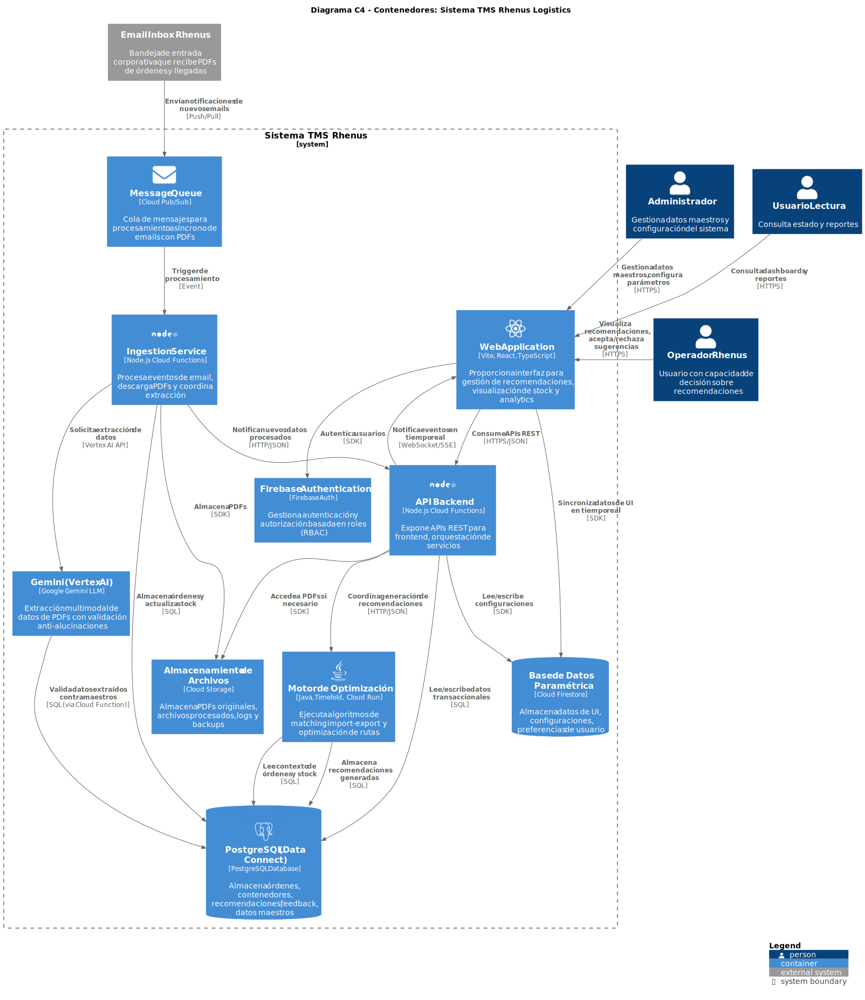
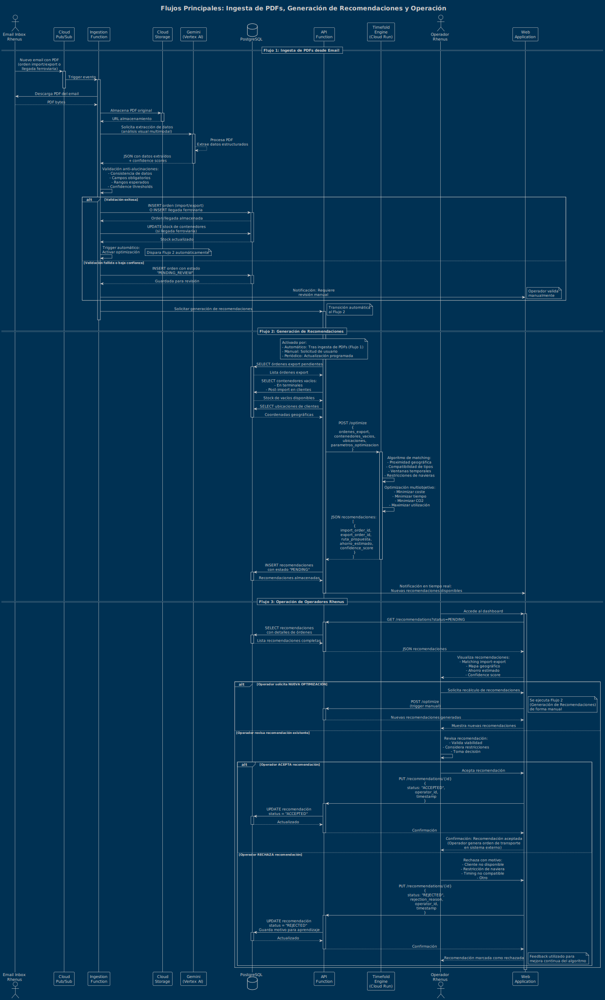

# Oferta Técnica - Rhenus Logistics

**Cliente:** Rhenus Logistics
**Fecha:** 11 de Enero de 2026
**Preparado por:** José - Arquitecto de Sistemas y Software

---

## Tabla de Contenidos

1. [Información del Cliente](#1-información-del-cliente)
2. [Resumen Ejecutivo](#2-resumen-ejecutivo)
3. [Objetivos del Proyecto](#3-objetivos-del-proyecto)
   - 3.1. [Contexto del Problema](#31-contexto-del-problema)
   - 3.2. [Objetivos Principales](#32-objetivos-principales)
   - 3.3. [Capacidades Clave del Sistema](#33-capacidades-clave-del-sistema)
   - 3.4. [Alcance del MVP](#34-alcance-del-mvp)
   - 3.5. [Modelo de Operación del MVP](#35-modelo-de-operación-del-mvp)
   - 3.6. [Capacidades de Análisis y Visualización](#36-capacidades-de-análisis-y-visualización)
   - 3.7. [Supuestos e Incógnitas del Proyecto](#37-supuestos-e-incógnitas-del-proyecto)
4. [Alcance de la Solución](#4-alcance-de-la-solución)
   - 4.1. [Visión General del Sistema](#41-visión-general-del-sistema)
   - 4.2. [Componentes Principales](#42-componentes-principales)
   - 4.3. [Perfiles de Usuario](#43-perfiles-de-usuario)
   - 4.4. [Funcionalidades Core](#44-funcionalidades-core)
   - 4.5. [Gestión de Datos Maestros](#45-gestión-de-datos-maestros)
   - 4.6. [Aspectos Técnicos Clave](#46-aspectos-técnicos-clave)
   - 4.7. [Funcionalidades Fuera de Alcance del MVP](#47-funcionalidades-fuera-de-alcance-del-mvp)
5. [Arquitectura Técnica Propuesta](#5-arquitectura-técnica-propuesta)
   - 5.1. [Visión General de la Arquitectura](#51-visión-general-de-la-arquitectura)
   - 5.2. [Stack Tecnológico](#52-stack-tecnológico)
   - 5.3. [Flujos de Datos Principales](#53-flujos-de-datos-principales)
   - 5.4. [Escalabilidad y Rendimiento](#54-escalabilidad-y-rendimiento)
   - 5.5. [Seguridad](#55-seguridad)
   - 5.6. [Consideraciones de Implementación](#56-consideraciones-de-implementación)
   - 5.7. [Diagramas de Arquitectura](#57-diagramas-de-arquitectura)
6. [Tecnologías y Herramientas](#6-tecnologías-y-herramientas)
   - 6.1. [Plataforma Cloud y Servicios Core](#61-plataforma-cloud-y-servicios-core)
   - 6.2. [Frontend](#62-frontend)
   - 6.3. [Backend y APIs](#63-backend-y-apis)
   - 6.4. [Motor de Optimización](#64-motor-de-optimización)
   - 6.5. [Bases de Datos](#65-bases-de-datos)
   - 6.6. [Almacenamiento y Mensajería](#66-almacenamiento-y-mensajería)
   - 6.7. [Autenticación, Seguridad y Secrets](#67-autenticación-seguridad-y-secrets)
   - 6.8. [Observabilidad y Monitoring](#68-observabilidad-y-monitoring)
   - 6.9. [CI/CD y DevOps](#69-cicd-y-devops)
   - 6.10. [Herramientas de Desarrollo](#610-herramientas-de-desarrollo)
   - 6.11. [Testing y Calidad](#611-testing-y-calidad)
   - 6.12. [Gestión de Proyecto](#612-gestión-de-proyecto)
   - 6.13. [Librerías y Frameworks Adicionales Clave](#613-librerías-y-frameworks-adicionales-clave)
   - 6.14. [Costes Estimados de Infraestructura Cloud (MVP)](#614-costes-estimados-de-infraestructura-cloud-mvp)
7. [Riesgos y Mitigación](#7-riesgos-y-mitigación)
   - 7.1. [Metodología de Gestión de Riesgos](#71-metodología-de-gestión-de-riesgos)
   - 7.2. [Riesgos Técnicos](#72-riesgos-técnicos)
   - 7.3. [Riesgos de Proyecto](#73-riesgos-de-proyecto)
   - 7.4. [Riesgos de Negocio](#74-riesgos-de-negocio)
   - 7.5. [Riesgos de Seguridad y Cumplimiento](#75-riesgos-de-seguridad-y-cumplimiento)
   - 7.6. [Matriz de Riesgos (Probabilidad × Impacto)](#76-matriz-de-riesgos-probabilidad--impacto)
   - 7.7. [Plan de Comunicación de Riesgos](#77-plan-de-comunicación-de-riesgos)
   - 7.8. [Lecciones Aprendidas y Mejora Continua](#78-lecciones-aprendidas-y-mejora-continua)

---

## 1. Información del Cliente

Rhenus Logistics es una empresa de logística global con:
- Presencia en España desde 1964
- 37 delegaciones en Península, Canarias y Baleares
- Parte del Rhenus Group (8.6 billones € facturación anual, 39.000 empleados, 1.120 ubicaciones)
- Servicios: Transporte (aéreo, marítimo, carretera, ferroviario), almacenamiento, logística portuaria, soluciones digitales

---

## 2. Resumen Ejecutivo

### El Desafío

Rhenus Logistics enfrenta uno de los mayores retos de la industria del transporte de contenedores: el **reposicionamiento de contenedores vacíos**, un problema que genera aproximadamente **$20 billones en costes anuales a nivel global**. El 33% de los contenedores en circulación están vacíos y los contenedores pasan casi el 50% de su vida útil inactivos, generando costes innecesarios de transporte, almacenamiento y emisiones de CO2.

En las operaciones de Rhenus en la zona norte de España, los contenedores de **importación** que quedan vacíos en ubicaciones de clientes son devueltos a terminales (Barcelona o terminales ferroviarias), mientras que las órdenes de **exportación** requieren recoger contenedores vacíos de esas mismas terminales. **Este doble viaje (devolución + recogida) es completamente evitable** si se conecta un contenedor vacío de import con una orden cercana de export.

### La Solución Propuesta

Proponemos desarrollar un **MVP (Minimum Viable Product)** de un sistema TMS avanzado con inteligencia artificial que optimice el uso de contenedores vacíos mediante **matching inteligente import-export**. El sistema funcionará como una **plataforma de apoyo a la decisión** que proporcionará recomendaciones inteligentes a los operadores de Rhenus, manteniendo el control humano en la toma de decisiones finales.

**Alcance del MVP:**
- **Geográfico:** Zona norte de España (Bilbao como centro de operaciones, Barcelona como terminal marítima, Noain/Agoncillo/Miranda como terminales ferroviarias)
- **Modos de transporte:** TRAIN (ferroviario) y TRUCK (carretera)
- **Tipos de contenedores:** 22G1 (20'DV), 42G1 (40'DV), 45G1 (40'HC)
- **Propietarios:** Todos los contenedores son propiedad de navieras (Maersk, Hapag-Lloyd, MSC, CMA CGM, ONE)

### Capacidades Clave del Sistema

1. **Procesamiento Automático de PDFs con LLM Multimodal (Google Gemini)**
   - Extracción automática de datos de órdenes de import/export
   - Procesamiento de PDFs de llegadas ferroviarias (contenedores vacíos y llenos)
   - Validación anti-alucinaciones para garantizar precisión
   - Actualización automática de stock en terminales

2. **Motor de Optimización con Timefold**
   - Matching inteligente entre contenedores vacíos de import y órdenes de export cercanas
   - Cálculo de rutas óptimas multiobjetivo (coste + tiempo + CO2)
   - Generación de recomendaciones con nivel de confianza
   - **Valor tangible:** Eliminación de hasta 2 viajes por cada matching exitoso (33% reducción en el ejemplo de la sección 3.1)

3. **Visualización y Analytics**
   - Dashboard con KPIs de optimización, adopción e impacto
   - Mapa geográfico interactivo mostrando stock, oportunidades de matching y rutas
   - Visualización completa del ciclo de vida de contenedores
   - Reportes de ahorro económico y reducción de emisiones CO2

4. **Sistema de Feedback y Aprendizaje**
   - Captura de aceptación/rechazo de recomendaciones con motivos
   - Métricas de adopción del sistema por operadores
   - Base para mejora continua del algoritmo

### Stack Tecnológico

**Cloud-native en Google Cloud Platform:**
- **Frontend:** Vite + React + TypeScript (Firebase Hosting)
- **Backend:** Node.js Cloud Functions + Cloud Firestore (UI parametric data)
- **Motor de Optimización:** Java + Timefold en Cloud Run
- **LLM:** Google Gemini (Vertex AI) para procesamiento de PDFs
- **Base de Datos:** PostgreSQL (Firebase Data Connect) para datos transaccionales
- **Ingesta:** Cloud Pub/Sub + Cloud Functions (sujeto a configuración de inbox de Rhenus)
- **Arquitectura serverless-first** para minimizar overhead operativo y costes

### Riesgos Principales y Mitigaciones

**Riesgos críticos identificados:**
1. **Precisión del LLM en PDFs:** Mitigación mediante testing temprano, validación anti-alucinaciones, human-in-the-loop para casos de baja confianza
2. **Integración con inbox de email:** Coordinación temprana con IT de Rhenus, alternativas (IMAP, upload manual) si necesario
3. **Adopción por operadores:** Involucrar usuarios desde Discovery, UX intuitivo, demostrar valor en beta privada
4. **Complejidad operativa real:** Discovery exhaustivo en Fase 0, enfoque iterativo, priorizar casos comunes (80/20)

Enfoque proactivo de gestión de riesgos con revisión semanal, escalación clara y planes de contingencia para todos los riesgos identificados.

### Valor Diferencial de Esta Propuesta

1. **Enfoque de apoyo a la decisión:** El MVP proporciona recomendaciones inteligentes pero mantiene control humano, minimizando riesgos operativos y generando confianza
2. **Stack moderno y coste-efectivo:** Arquitectura serverless en GCP minimiza overhead operativo y costes de infraestructura
3. **IA aplicada con validación:** Uso de LLM multimodal (Gemini) para automatización de ingesta con robustas validaciones anti-alucinaciones
4. **Optimización algorítmica avanzada:** Motor Timefold (evolución de OptaPlanner) para constraint-based optimization de clase mundial
5. **Visibilidad y analytics:** No solo optimización, sino también comprensión profunda del negocio mediante dashboards y métricas
6. **Escalable post-MVP:** Arquitectura preparada para expansión a otras zonas geográficas y modos de transporte
7. **Impacto demostrable:** Eliminación de viajes innecesarios (hasta 33% de reducción en casos de matching exitoso), reducción de emisiones CO2 y mejor utilización de contenedores

### Próximos Pasos

1. **Revisión y validación** de esta oferta técnica con stakeholders de Rhenus
2. **Kick-off del proyecto** y arranque de la fase de descubrimiento
3. **Discovery workshops** con operadores y áreas de negocio de Rhenus
4. **Validación de supuestos** técnicos y de negocio
5. **Inicio de desarrollo** tras aprobación de especificación funcional detallada

Estamos preparados para iniciar el proyecto tan pronto como Rhenus esté listo, con un equipo experimentado en proyectos de logística, optimización y cloud-native development.

---

## 3. Objetivos del Proyecto

### 3.1. Contexto del Problema

El reposicionamiento de contenedores vacíos representa uno de los mayores desafíos en la industria logística:
- **Coste global:** Aproximadamente $20 billones anuales para la industria del transporte de contenedores
- **Ineficiencia:** ~33% de los contenedores en circulación están vacíos
- **Tiempo inactivo:** El contenedor promedio pasa casi el 50% de su vida útil inactivo
- **Origen:** Desequilibrio en el comercio exterior (mercados orientados a importación vs exportación)

#### Flujos Operativos de Contenedores en Rhenus

**Nota:** Los flujos descritos a continuación están sujetos a confirmación con el cliente durante la fase de descubrimiento.

**Flujo IMPORT tradicional (Contenedor lleno → Cliente → Devolución vacío):**
1. Contenedor **LLENO** llega a terminal marítima de Barcelona
2. Se recibe orden de import en PDF
3. TRUCK recoge contenedor lleno en Barcelona
4. TRUCK transporta contenedor a ubicación del cliente
5. Cliente descarga mercancía (contenedor queda **VACÍO**)
6. TRUCK devuelve contenedor vacío a terminal (puede ser Barcelona o terminal ferroviaria: Noain, Agoncillo, Miranda)

**Flujo EXPORT (Contenedor vacío → Cliente → Puerto):**
1. Se recibe orden de export en PDF
2. TRUCK recoge contenedor **VACÍO** de una terminal (Barcelona o terminales ferroviarias: Noain, Agoncillo, Miranda)
3. TRUCK transporta contenedor vacío a ubicación del cliente
4. Cliente carga mercancía (contenedor queda **LLENO**)
5. TRUCK transporta contenedor lleno a terminal marítima de Barcelona
6. Contenedor se entrega en Barcelona para su envío marítimo

**Ciclo de Distribución de Contenedores vía TREN:**
1. Contenedores llegan a Barcelona vía marítima (import o contenedores vacíos de retorno)
2. Contenedores se envían mediante **TREN** desde Barcelona a terminales ferroviarias (Noain, Agoncillo, Miranda)
3. Se recibe PDF con información de contenedores que llegan a terminales ferroviarias
4. Actualización de stock según estado:
   - **Contenedores VACÍOS:** Disponibles para nuevas órdenes de export
   - **Contenedores LLENOS:** Pendientes de entrega a clientes en la zona (import)

#### El Problema de Ineficiencia Actual y el Valor del Reposicionamiento Inteligente

**Situación SIN optimización (flujo tradicional separado):**

*Para una operación IMPORT + EXPORT de clientes cercanos:*

**Import (Cliente A):**
1. Barcelona → Cliente A con contenedor **lleno** (TRUCK)
2. Cliente A descarga
3. **Cliente A → Terminal con contenedor VACÍO** (TRUCK - viaje de devolución a Barcelona o terminal ferroviaria)

**Export (Cliente B cercano al Cliente A):**
4. **Terminal → Cliente B con contenedor VACÍO** (TRUCK - viaje de recogida desde Barcelona o terminal ferroviaria)
5. Cliente B carga
6. Cliente B → Barcelona con contenedor **lleno** (TRUCK)

**Total: 6 viajes**, de los cuales:
- 2 viajes útiles con carga (1 lleno import, 1 lleno export)
- **4 viajes con contenedores vacíos o retornos**
- **2 viajes completamente EVITABLES** (devolución vacío + recogida vacío)

---

**Situación CON optimización (matching import-export):**

*Misma operación IMPORT + EXPORT con matching inteligente:*

**Import + Export optimizado:**
1. Barcelona → Cliente A con contenedor **lleno** (TRUCK)
2. Cliente A descarga (contenedor queda vacío)
3. **Cliente A → Cliente B con contenedor VACÍO** (TRUCK - reposicionamiento directo)
4. Cliente B carga
5. Cliente B → Barcelona con contenedor **lleno** (TRUCK)

**Total: 5 viajes**, de los cuales:
- 2 viajes útiles con carga (1 lleno import, 1 lleno export)
- **3 viajes necesarios** (solo 1 vacío entre clientes cercanos)

---

**VALOR DEL REPOSICIONAMIENTO INTELIGENTE:**
- **1 viaje ELIMINADO** (33% menos viajes que con matching vs sin matching para este ejemplo)
- **Se elimina:** Viaje vacío Cliente A → Terminal + Viaje vacío Terminal → Cliente B
- **Se añade:** Solo 1 viaje vacío Cliente A → Cliente B (distancia mucho menor)
- **Ahorro real:** Kilómetros, combustible, tiempo, coste operativo, emisiones CO2
- **Mejora utilización:** Contenedor pasa menos tiempo inactivo en terminal

Rhenus Logistics actualmente dispone de un sistema TMS que no cubre adecuadamente esta optimización del uso de contenedores vacíos, generando:
- Costes innecesarios de reposicionamiento de contenedores vacíos
- Retornos a terminal de contenedores que podrían reutilizarse directamente
- Falta de visibilidad sobre oportunidades de matching import-export
- Emisiones evitables de CO2 por transporte de contenedores vacíos

### 3.2. Objetivos Principales

El proyecto tiene como objetivo desarrollar un **MVP (Minimum Viable Product)** de un sistema TMS avanzado con capacidades de IA que permita:

#### 3.2.1. Reducción de Costes Operativos
- Minimizar transportes de contenedores vacíos mediante matching inteligente
- Reducir retornos innecesarios a terminal
- Optimizar el uso de la flota de contenedores disponible

#### 3.2.2. Maximización de Utilización de Contenedores
- Aumentar el tiempo activo de los contenedores (reducir inactividad del 50% actual)
- Conectar directamente contenedores de importación con necesidades de exportación
- Mejorar la rotación y disponibilidad del stock de contenedores

#### 3.2.3. Sostenibilidad Ambiental
- Reducir emisiones de CO2 mediante optimización de rutas
- Minimizar kilómetros en vacío
- Contribuir a objetivos de sostenibilidad corporativa

#### 3.2.4. Optimización Multimodal
- Planificación inteligente de rutas considerando dos modos de transporte:
  - **TRAIN (ferroviario):** Para trayectos entre Barcelona y terminales ferroviarias (Noain, Agoncillo, Miranda)
  - **TRUCK (carretera):** Para primeros/últimos tramos y trayectos completos
- Optimización multiobjetivo: coste, tiempo, emisiones y disponibilidad
- Coordinación eficiente entre ambos medios de transporte

### 3.3. Capacidades Clave del Sistema

El sistema deberá incorporar las siguientes capacidades de optimización e inteligencia artificial:

1. **Matching Inteligente Import-Export**
   - Identificar automáticamente oportunidades de reutilización directa de contenedores:
     - Contenedor de **import** que queda vacío en ubicación del cliente
     - Orden de **export** de un cliente cercano que necesita contenedor vacío
     - Evitar retorno del contenedor vacío a terminal
     - Evitar viaje de recogida de contenedor vacío desde terminal
   - Considerar proximidad geográfica entre clientes
   - Analizar compatibilidad de tipos de contenedores y requisitos
   - Evaluar ventanas temporales de disponibilidad

2. **Predicción de Demanda**
   - Anticipar necesidades futuras de contenedores por ruta, cliente y tipo
   - Facilitar planificación proactiva del stock de contenedores

3. **Optimización de Rutas Multiobjetivo**
   - Algoritmos que consideren simultáneamente: coste, tiempo de tránsito, emisiones de CO2 y disponibilidad de recursos
   - Soporte para rutas multimodales (combinación de TRAIN y TRUCK)
   - Consideración de restricciones geográficas (terminales: Barcelona, Noain, Agoncillo, Miranda)

4. **Alertas y Recomendaciones Proactivas**
   - Notificaciones automáticas de oportunidades de optimización
   - Sugerencias inteligentes para mejorar eficiencia operativa

### 3.4. Alcance del MVP

- **Geográfico:** Operaciones de Rhenus Logistics en la zona norte de España:
  - **Bilbao:** Centro de gestión de órdenes
  - **Barcelona:** Puerto marítimo
  - **Depots/Estaciones ferroviarias:** Noain, Agoncillo y Miranda
- **Modos de transporte:** TRAIN (ferroviario) y TRUCK (carretera)
- **Integración inicial:** Sistema de ingesta vía inbox de correo electrónico para procesar PDFs:
  - PDFs con órdenes de import/export
  - PDFs con información de llegadas de contenedores (vacíos o llenos) vía tren a terminales ferroviarias (para gestión de stock en depots)
- **Datos:** Stock de contenedores y datos maestros precargados en el sistema para validación inicial
- **Enfoque:** Desarrollo iterativo para validar el concepto antes de escalar a otras zonas geográficas y modos de transporte

### 3.5. Modelo de Operación del MVP

**Sistema de Recomendaciones para Operadores**

El MVP funcionará como un **sistema de apoyo a la decisión** que proporciona sugerencias inteligentes a los operadores de Rhenus, manteniendo el control humano en la toma de decisiones:

- **Sugerencias, no automatización:** El sistema analizará las órdenes de import/export y generará recomendaciones sobre movimientos óptimos de contenedores, pero serán los operadores quienes decidan ejecutarlas o no
- **Sin integración con sistemas de ejecución:** El MVP **NO se integrará** con ningún sistema externo que genere automáticamente órdenes de transporte
- **Flujo manual validado:** Los operadores revisarán las sugerencias del sistema y, si las aprueban, procederán a generar las órdenes de transporte a través de sus procesos actuales
- **Aprendizaje iterativo:** El feedback de los operadores sobre las sugerencias aceptadas/rechazadas servirá para mejorar el modelo en futuras iteraciones

Este enfoque permite:
1. Validar la precisión y utilidad de las recomendaciones antes de cualquier automatización
2. Mantener el conocimiento y experiencia de los operadores en el proceso
3. Minimizar riesgos operativos durante la fase de prueba
4. Generar confianza en el sistema antes de escalar

### 3.6. Capacidades de Análisis y Visualización

El MVP incorporará funcionalidades de análisis y visualización que permitan tanto a operadores como a la dirección de negocio evaluar el estado actual y la efectividad del sistema:

#### 3.6.1. Visualización de Stock de Contenedores

El sistema proporcionará visibilidad completa del ciclo de vida de contenedores:

- **Contenedores en terminales:**
  - Stock de contenedores en:
    - **Terminales ferroviarias:** Noain, Agoncillo y Miranda (actualizados con PDFs de llegadas de tren)
      - Contenedores **VACÍOS**: Disponibles para órdenes de export
      - Contenedores **LLENOS**: Pendientes de entrega a clientes (import)
    - **Barcelona:** Terminal marítima
      - Contenedores vacíos devueltos de operaciones import
      - Contenedores llenos de importación marítima
  - Disponibles para ser asignados según estado y operación

- **Contenedores en tránsito (en rutas activas):**
  - **Import en curso:** Contenedores llenos en ruta desde Barcelona hacia clientes
  - **Export en curso:** Contenedores en ruta desde terminales/clientes hacia Barcelona

- **Contenedores post-import (vacíos en ubicaciones de clientes):**
  - Contenedores que han completado entregas de import y están vacíos en ubicación del cliente
  - **Candidatos para matching:** Disponibles para ser reutilizados en órdenes de export cercanas
  - Visualización de tiempo desde que quedaron vacíos
  - Proximidad a órdenes de export pendientes

- **Distribución geográfica:** Mapa de la zona norte mostrando:
  - Terminales ferroviarias con stock de vacíos (Noain, Agoncillo, Miranda)
  - Barcelona (terminal marítima)
  - Ubicaciones de clientes con contenedores vacíos post-import
  - Ubicaciones de clientes con órdenes de export pendientes
  - Oportunidades de matching visualizadas geográficamente
  - Centro de gestión en Bilbao (sin stock físico de contenedores)

- **Estados y tipos:** Clasificación por:
  - Tipo de contenedor (22G1=20'DV, 42G1=40'DV, 45G1=40'HC)
  - Estado (vacío en terminal, vacío en cliente, lleno en tránsito, etc.)
  - Disponibilidad y restricciones

#### 3.6.2. Métricas de Efectividad del Sistema
El sistema proporcionará indicadores clave (KPIs) para que el negocio pueda evaluar el retorno de la inversión:

- **Métricas de optimización:**
  - **% de matching import-export exitoso:** Porcentaje de contenedores de import reutilizados directamente para export (sin retorno a terminal)
  - **Viajes evitados:** Número de viajes de retorno a terminal y recogidas desde terminal eliminados
  - **Reducción de kilómetros:** Kilómetros totales ahorrados por matching directo vs. ruta tradicional
  - **Reducción de kilómetros en vacío:** Kilómetros específicamente evitados de transporte de contenedores vacíos
  - **Tiempo de inactividad:** Tiempo promedio que un contenedor permanece inactivo entre operaciones
  - **Tasa de utilización:** Porcentaje de tiempo que contenedores están en uso activo vs. inactivos

- **Métricas de adopción:**
  - % de sugerencias aceptadas vs. rechazadas por operadores
  - Tiempo medio de respuesta a las recomendaciones
  - Motivos de rechazo de sugerencias (para mejora continua)

- **Métricas de impacto económico y ambiental:**
  - Ahorro estimado en costes de reposicionamiento
  - Reducción estimada de emisiones de CO2
  - ROI proyectado del sistema

#### 3.6.3. Dashboard Analítico
Interface visual que consolide toda la información relevante para la toma de decisiones y evaluación del sistema.

### 3.7. Supuestos e Incógnitas del Proyecto

Es importante reconocer que existen aspectos del proceso actual de Rhenus que aún deben ser definidos y que se resolverán durante la ejecución del proyecto:

#### Incógnitas a Resolver
- **Procedimiento actual de asignación:** Cómo gestiona actualmente Rhenus la asignación de contenedores a rutas (criterios, responsables, herramientas utilizadas)
- **Reglas de negocio específicas:** Restricciones, prioridades de clientes, acuerdos comerciales que puedan afectar la asignación de contenedores
- **Fuentes de datos existentes:** Qué datos están disponibles actualmente, en qué formato, y con qué nivel de calidad
- **Procesos de coordinación:** Cómo se coordinan actualmente las diferentes delegaciones y modos de transporte

#### Enfoque de Resolución
Estas incógnitas se abordarán mediante:
1. **Fase de descubrimiento inicial:** Sesiones de trabajo con operadores y responsables de Rhenus para mapear procesos actuales
2. **Desarrollo iterativo:** El MVP se irá ajustando según el conocimiento adquirido durante el proyecto
3. **Colaboración continua:** Comunicación frecuente con el equipo de Rhenus para validar supuestos y ajustar la solución

---

## 4. Alcance de la Solución

### 4.1. Visión General del Sistema

El MVP consistirá en una **plataforma web de apoyo a la decisión** que permita a los operadores de Rhenus Logistics optimizar el uso de contenedores mediante recomendaciones inteligentes basadas en IA. El sistema incluirá capacidades de análisis, visualización y gestión de datos maestros.

### 4.2. Componentes Principales

El sistema estará compuesto por los siguientes módulos:

1. **Motor de Ingesta de Datos**
   - Monitorización automática de inbox de correo electrónico
   - Extracción automática de datos de PDFs mediante **LLMs multimodales**:
     - Análisis visual de documentos PDF
     - Extracción y estructuración de datos en formato estándar (JSON)
     - Procesamiento de órdenes de import/export
     - Procesamiento de llegadas de contenedores (vacíos o llenos) vía tren a terminales ferroviarias (Noain, Agoncillo, Miranda)
   - Procesamiento en tiempo real o near-real-time
   - Sistema de validación para detección de inconsistencias y alucinaciones del modelo
   - Alertas en caso de errores o baja confianza en la extracción
   - Actualización automática de stock en depots con base en información de llegadas validada (diferenciando entre contenedores vacíos y llenos)

2. **Motor de Optimización y Recomendaciones**
   - Algoritmos de matching inteligente import-export
   - Optimización multiobjetivo (coste, tiempo, emisiones CO2, disponibilidad)
   - Predicción de demanda futura de contenedores
   - Cálculo de rutas multimodales óptimas (TRAIN + TRUCK)
   - Generación de nivel de confianza para cada recomendación

3. **Interface de Usuario Web Responsive**
   - Accesible desde navegadores en desktop y tablets
   - Gestión de recomendaciones (revisión, aceptación/rechazo)
   - Visualización de órdenes activas y planificadas
   - Gestión de datos maestros

4. **Dashboard Analítico**
   - Visualización de KPIs en tiempo real
   - Reportes de efectividad del sistema
   - Análisis de tendencias y patrones

5. **Módulo de Gestión de Datos Maestros**
   - Administración de contenedores, depots, rutas, clientes, navieras
   - Configuración de parámetros de optimización
   - Gestión de usuarios y permisos

### 4.3. Perfiles de Usuario

El sistema contemplará diferentes niveles de acceso y funcionalidades según el rol del usuario:

**Nota:** Los perfiles específicos de usuario se definirán con mayor detalle durante la fase de descubrimiento del proyecto.

1. **Usuarios con Capacidad de Decisión**
   - Visualización de recomendaciones de optimización
   - Aceptación/rechazo de sugerencias con justificación
   - Consulta de estado de contenedores y rutas
   - Generación de órdenes de transporte (fuera del sistema, en sus procesos actuales)

2. **Usuarios de Visualización (Solo Lectura)**
   - Consulta de estado de contenedores
   - Visualización de rutas planificadas y en curso
   - Acceso a reportes y dashboards

3. **Administradores del Sistema**
   - Configuración del inbox de correo
   - Ajuste de pesos y criterios de optimización
   - Gestión de datos maestros (contenedores, depots, navieras, clientes, rutas, tarifas)
   - Administración de usuarios y permisos
   - Configuración de parámetros del sistema

### 4.4. Funcionalidades Core

#### 4.4.1. Procesamiento Automático de Datos

El sistema procesará dos tipos de PDFs recibidos en el inbox utilizando **LLMs multimodales** para la extracción de información:

**Tecnología de Extracción:**
- **LLMs multimodales:** Modelos de lenguaje con capacidad de análisis visual de documentos
- **Análisis visual:** Lectura e interpretación del contenido del PDF sin necesidad de OCR tradicional
- **Estructuración en JSON:** Extracción de datos y conversión automática a formato estándar JSON
- **Validación anti-alucinaciones:** Sistema de validación para detectar:
  - Inconsistencias en los datos extraídos
  - Posibles alucinaciones del modelo LLM
  - Campos extraídos con baja confianza
  - Valores fuera de rangos esperados

**A) PDFs de Órdenes Import/Export**

El sistema procesará dos tipos de órdenes con diferentes flujos:

**Órdenes de IMPORT (Contenedor lleno → Cliente → Devolución vacío):**
- **Extracción de datos mediante LLM multimodal:**
  - Cliente (destinatario de la mercancía)
  - Ubicación del cliente (destino de entrega)
  - Tipo y cantidad de contenedores (22G1, 42G1, 45G1)
  - Fecha/hora de recogida en Barcelona (terminal marítima)
  - Fecha/hora estimada de entrega en cliente
  - Requisitos especiales del contenedor o mercancía
  - Naviera propietaria del contenedor (Maersk, Hapag-Lloyd, MSC, etc.)
  - Terminal de devolución preferida (Barcelona, Noain, Agoncillo o Miranda)
- **Flujo tradicional:** Barcelona (lleno) → TRUCK → Cliente (descarga, vacío) → TRUCK → Terminal (Barcelona o ferroviaria)
- **Flujo optimizado (con matching):** Barcelona (lleno) → TRUCK → Cliente A (descarga, vacío) → TRUCK → Cliente B export (evita devolución a terminal)
- **Estado relevante para matching:** Contenedor vacío disponible en ubicación del cliente después de descarga

**Órdenes de EXPORT (Cliente → Contenedor lleno → Barcelona):**
- **Extracción de datos mediante LLM multimodal:**
  - Cliente (origen de la mercancía)
  - Ubicación del cliente (recogida de contenedor vacío)
  - Tipo y cantidad de contenedores requeridos
  - Fecha/hora de recogida en cliente
  - Fecha/hora límite de entrega en Barcelona
  - Requisitos especiales del contenedor o mercancía
  - Naviera de destino
  - Terminal de recogida preferida para contenedor vacío (Barcelona, Noain, Agoncillo o Miranda)
- **Flujo tradicional:** Terminal (Barcelona o ferroviaria) → TRUCK → Cliente (carga, lleno) → TRUCK → Barcelona
- **Flujo optimizado (con matching):** Usar contenedor vacío de import cercano en lugar de recoger de terminal

**Salida común:**
- Datos estructurados en formato JSON
- **Validación:** Detección de inconsistencias y alucinaciones
- **Notificaciones:** Alertas a usuarios cuando se requiere intervención manual o validación humana

**B) PDFs de Llegadas de Contenedores Ferroviarios**

Estos PDFs contienen información sobre contenedores (tanto **VACÍOS** como **LLENOS**) que llegan mediante TREN desde Barcelona a las terminales ferroviarias.

**Contexto de los flujos:**

*Contenedores VACÍOS:*
1. Contenedores export enviados por mar desde Barcelona
2. Contenedores vacíos regresan a Barcelona (gestionados por navieras)
3. Se envían con TREN desde Barcelona a terminales ferroviarias (Noain/Agoncillo/Miranda)
4. PDF informa de la llegada de contenedores vacíos
5. Quedan disponibles para nuevas órdenes de export

*Contenedores LLENOS:*
1. Contenedores llenos llegan a Barcelona vía marítima (importación)
2. Se envían con TREN desde Barcelona a terminales ferroviarias (Noain/Agoncillo/Miranda)
3. PDF informa de la llegada de contenedores llenos
4. Disponibles para entrega a clientes en la zona

**Extracción de datos mediante LLM multimodal:**
- Terminal ferroviaria de destino (Noain, Agoncillo o Miranda)
- Identificación de contenedores
- Tipo y características de contenedores (22G1, 42G1, 45G1)
- Fecha y hora de llegada
- **Estado del contenedor (VACÍO o LLENO)**
- Naviera propietaria
- Si está lleno: cliente destinatario o referencia de orden de import

**Procesamiento:**
- **Salida:** Datos estructurados en formato JSON
- **Validación:** Verificación de consistencia de datos extraídos
- **Actualización de stock:** Actualización automática del inventario en el depot correspondiente según estado:
  - Contenedores VACÍOS: Disponibles para órdenes de export
  - Contenedores LLENOS: Pendientes de entrega a clientes
- **Notificaciones:** Alertas sobre nuevas llegadas y disponibilidad de contenedores

#### 4.4.2. Motor de Recomendaciones de Optimización

El sistema generará recomendaciones inteligentes de matching import-export para optimizar el uso de contenedores vacíos.

**Tipos de Recomendaciones:**

**1. Matching Directo Import → Export (Optimización principal):**
- **Situación detectada:**
  - Orden de IMPORT: Contenedor lleno entregado al Cliente A, después de descarga quedará vacío
  - Orden de EXPORT: Cliente B en ubicación cercana al Cliente A necesita contenedor vacío
- **Recomendación:**
  - Usar el contenedor vacío del import del Cliente A directamente para el export del Cliente B
  - Evitar devolución del vacío a terminal (Barcelona o terminal ferroviaria)
  - Evitar recogida de vacío desde terminal (Barcelona o terminal ferroviaria)

- **Comparación de rutas:**
  - **SIN optimización (tradicional):**
    1. Barcelona → Cliente A (lleno) - Import
    2. Cliente A → Terminal (vacío) - Devolución
    3. Terminal → Cliente B (vacío) - Recogida export
    4. Cliente B → Barcelona (lleno) - Export
    - **Total:** 4 viajes

  - **CON optimización (matching):**
    1. Barcelona → Cliente A (lleno) - Import
    2. Cliente A → Cliente B (vacío) - Reposicionamiento directo
    3. Cliente B → Barcelona (lleno) - Export
    - **Total:** 3 viajes

  - **Ahorro:** 1 viaje eliminado (25% reducción)
  - **Detalle:** Se eliminan los viajes Cliente A → Terminal + Terminal → Cliente B
  - **Se añade:** Solo el viaje directo Cliente A → Cliente B (típicamente distancia mucho menor)

**2. Recogida de Contenedor Vacío Optimizada:**
- Cuando no hay matching directo import-export disponible
- Seleccionar la terminal óptima para recoger contenedor vacío:
  - Barcelona (terminal marítima)
  - Noain, Agoncillo o Miranda (terminales ferroviarias)
- Considerar proximidad al cliente export, disponibilidad de stock en cada terminal, y costes de transporte

**Información incluida en cada recomendación:**

- **Matching específico:**
  - ID de orden de import (contenedor que quedará vacío)
  - ID de orden de export (que necesita contenedor vacío)
  - Ubicaciones de clientes y distancia entre ellos
  - Compatibilidad de tipos de contenedores

- **Ruta propuesta detallada:**
  - Secuencia de movimientos paso a paso
  - Modo de transporte en cada tramo (**TRUCK**)
  - Puntos de origen, intermedios y destino
  - Tiempos estimados por tramo

- **Impacto estimado vs. ruta tradicional:**
  - Ahorro económico (coste de transporte evitado)
  - Kilómetros evitados
  - Reducción de emisiones de CO2
  - Tiempo total de operación
  - Número de viajes/tramos eliminados

- **Nivel de confianza:**
  - Score (0-100%) que indica la fiabilidad de la recomendación
  - Factores considerados: proximidad geográfica, compatibilidad de contenedores, ventanas temporales, restricciones

**Estrategia de generación de recomendaciones:**

El sistema podrá operar en tiempo real al recibir nuevas órdenes, generando sugerencias inmediatamente.

**Incógnita a resolver durante el proyecto:** La estrategia de replanificación ante nuevas órdenes, modificaciones o cancelaciones aún debe definirse con Rhenus:
- ¿Replanificar todas las órdenes pendientes o solo la nueva?
- ¿Cómo gestionar recomendaciones ya aceptadas pero no ejecutadas cuando llega nueva información?
- ¿Qué ventana temporal considerar para replanificación?

#### 4.4.3. Gestión de Feedback de Recomendaciones

- **Aceptación/Rechazo:** Interface para que usuarios indiquen si aceptan o rechazan cada sugerencia
- **Motivos de rechazo:** Captura de razones para retroalimentar el modelo
- **Tracking de ejecución:** Registro de qué recomendaciones aceptadas fueron realmente ejecutadas
- **Aprendizaje continuo:** Uso del feedback para mejorar futuras recomendaciones

#### 4.4.4. Visualización de Stock y Estado de Contenedores

El sistema proporcionará múltiples vistas para entender el estado completo del inventario de contenedores:

**Vista por Estados del Ciclo de Vida:**

1. **Contenedores en Terminales:**
   - **Terminales ferroviarias:** Noain, Agoncillo, Miranda
     - Stock actualizado automáticamente con PDFs de llegadas de tren
     - **VACÍOS:** Disponibles para órdenes de export
     - **LLENOS:** Pendientes de entrega a clientes (import)
   - **Barcelona:** Terminal marítima
     - Contenedores vacíos devueltos de operaciones import
     - Contenedores llenos de importación marítima
   - Cantidad por tipo de contenedor (22G1, 42G1, 45G1) y estado en cada ubicación
   - Tiempo de permanencia en terminal

2. **Contenedores Post-Import (Vacíos en ubicaciones de clientes):**
   - **Vista crítica para matching:** Contenedores que completaron entregas de import
   - Ubicación del cliente donde quedaron vacíos
   - Tiempo transcurrido desde que quedaron vacíos
   - Indicador de proximidad a órdenes de export pendientes
   - Destacado visual de oportunidades de matching

3. **Contenedores en Tránsito:**
   - **Import activo:** Llenos desde Barcelona hacia clientes
   - **Export activo:** Desde ubicación origen (terminal o cliente) hacia Barcelona
   - Modo de transporte actual (TRUCK)
   - Progreso estimado de la ruta

**Mapa Geográfico Interactivo:**
- **Terminales con stock de vacíos:**
  - Terminales ferroviarias (Noain, Agoncillo, Miranda) con nivel de stock
  - Barcelona (terminal marítima) con nivel de stock de vacíos devueltos
- Clientes con contenedores vacíos post-import (pins en mapa)
- Clientes con órdenes de export pendientes (pins en mapa)
- **Visualización de oportunidades:** Líneas conectando contenedores vacíos en clientes con órdenes de export cercanas
- Rutas activas en tiempo real

**Filtros y Búsquedas:**
- Por tipo de contenedor (22G1=20'DV, 42G1=40'DV, 45G1=40'HC)
- Por ubicación (Barcelona, Noain, Agoncillo, Miranda, ubicaciones de clientes)
- Por estado (vacío en terminal, vacío en cliente, lleno en tránsito, etc.)
- Por disponibilidad temporal
- Por propietario/naviera
- Por edad (tiempo desde última operación)

#### 4.4.5. Dashboard y Métricas

Paneles visuales con los KPIs definidos en la sección 3.6.2:
- Métricas de optimización
- Métricas de adopción del sistema
- Métricas de impacto económico y ambiental
- Gráficos de tendencias temporales
- Comparativas antes/después de usar el sistema

### 4.5. Gestión de Datos Maestros

El sistema permitirá administrar la siguiente información:

**Nota:** Durante el proyecto se definirá qué datos son verdaderamente maestros (editables) y cuáles son paramétricos de solo lectura.

1. **Contenedores**
   - Inventario completo
   - **Tipos de contenedores (códigos ISO):**
     - **22G1:** 20'DV (20 pies Dry Van)
     - **42G1:** 40'DV (40 pies Dry Van)
     - **45G1:** 40'HC (40 pies High Cube)
   - Capacidades y características por tipo
   - Naviera dueña de cada contenedor (campo crítico para todas las operaciones)
   - Estado actual:
     - Vacío en terminal (Barcelona o ferroviarias: Noain/Agoncillo/Miranda) - disponible para export
     - Vacío en ubicación de cliente post-import (candidato para matching)
     - Lleno en tránsito import (Barcelona → Cliente)
     - En tránsito export (Cliente/Terminal → Barcelona)
     - En tránsito devolución (Cliente → Terminal con vacío)
     - En mantenimiento
   - Ubicación actual (terminal o cliente)
   - Historial de operaciones (última import/export)

2. **Depots/Terminales**
   - **Barcelona:** Terminal marítima (puerto)
     - Recepción de contenedores llenos de importación
     - Almacenamiento de contenedores vacíos devueltos de operaciones import
     - Envío de contenedores llenos de exportación
   - **Noain, Agoncillo, Miranda:** Terminales ferroviarias
     - Recepción de contenedores vía TREN desde Barcelona (vacíos o llenos)
     - Almacenamiento de contenedores vacíos disponibles para export
     - Almacenamiento de contenedores llenos pendientes de entrega a clientes (import)
   - Capacidades de almacenamiento por ubicación
   - Tipos de contenedores soportados en cada terminal
   - Costes de almacenamiento
   - Operadores y horarios de operación

3. **Clientes**
   - Información de clientes (nombre, identificación)
   - **Ubicaciones geográficas** (crítico para cálculo de proximidad y matching)
   - Coordenadas GPS o dirección completa
   - Tipos de contenedores que manejan habitualmente
   - Restricciones o requisitos especiales
   - Historial de operaciones import/export

4. **Rutas y Tarifas**
   - Costes de transporte TRUCK:
     - Entre terminales (Barcelona ↔ Noain/Agoncillo/Miranda)
     - Entre terminales y ubicaciones de clientes
     - Entre ubicaciones de clientes (para matching import-export)
   - Tiempos estimados de tránsito por modo:
     - **TRAIN:** Rutas ferroviarias entre Barcelona y terminales ferroviarias
     - **TRUCK:** Rutas por carretera (terminales, clientes)
   - Restricciones de capacidad por modo de transporte
   - Frecuencias de servicio ferroviario
   - Matriz de distancias para cálculo de proximidad

5. **Navieras**
   - Las navieras son las **ÚNICAS propietarias** de los contenedores
   - Principales navieras: Maersk, Hapag-Lloyd, Mediterranean Shipping Company, etc.
   - Acuerdos comerciales con Rhenus
   - Condiciones de uso de contenedores
   - Políticas de reposicionamiento de cada naviera
   - Restricciones específicas por naviera
   - Tarifas por uso de contenedores
   - Tiempos de free time (tiempo gratuito de uso)

6. **Parámetros de Optimización**
   - Pesos para los diferentes criterios (coste, tiempo, CO2)
   - **Radio máximo de matching:** Distancia máxima entre cliente import y cliente export para considerar matching directo
   - **Ventana temporal de matching:** Tiempo máximo entre disponibilidad de contenedor vacío y necesidad de export
   - Restricciones de negocio
   - Umbrales de alertas
   - Configuración del motor de IA

### 4.6. Aspectos Técnicos Clave

- **Arquitectura:** Cloud-native, escalable y modular
- **Disponibilidad:** Alta disponibilidad durante horario laboral
- **Rendimiento:** Procesamiento de órdenes en near-real-time (< 5 minutos desde recepción)
- **Seguridad:** Autenticación, autorización basada en roles, cifrado de datos sensibles
- **Trazabilidad:** Auditoría completa de acciones de usuarios y decisiones del sistema

### 4.7. Funcionalidades Fuera de Alcance del MVP

Para mantener el foco en la validación del concepto, las siguientes funcionalidades quedan **explícitamente fuera del alcance** de este MVP:

- Integración automática con sistemas externos (ERP, TMS existente, sistemas de navieras)
- Generación automática de órdenes de transporte
- Aplicación móvil nativa
- Tracking GPS en tiempo real de contenedores
- Integración con IoT/sensores
- Módulo de facturación
- Portal de clientes externos
- APIs públicas para terceros

---

## 5. Arquitectura Técnica Propuesta

### 5.1. Visión General de la Arquitectura

El MVP se desarrollará utilizando una arquitectura **cloud-native en Google Cloud Platform (GCP)**, combinando servicios de Firebase para desarrollo rápido con componentes especializados desplegados en GCP. El enfoque es **serverless-first** para minimizar overhead operativo y costes en la fase de MVP.

### 5.2. Stack Tecnológico

#### 5.2.1. Cloud Provider
- **Google Cloud Platform (GCP)** como proveedor principal
- Aprovechar el ecosistema integrado de servicios de Google

#### 5.2.2. Frontend
- **Framework:** Vite + React + TypeScript
  - Vite para builds rápidos y desarrollo ágil
  - React para UI componentes
  - TypeScript para type safety y mejor mantenibilidad
- **Hosting:** Firebase Hosting
  - CDN global
  - SSL automático
  - Despliegue simple y rápido

#### 5.2.3. Backend
- **Node.js Cloud Functions** para lógica de negocio ligera:
  - Procesamiento de webhooks/eventos
  - Orquestación de servicios
  - APIs REST para frontend
  - Integraciones con servicios externos
- **Serverless:** Escala automáticamente según demanda

#### 5.2.4. Motor de Optimización
- **Lenguaje:** Java
- **Framework:** Timefold (evolución de OptaPlanner)
  - Constraint-based optimization
  - Ideal para problemas de routing y scheduling
  - Soporte para optimización multiobjetivo
  - Algoritmos avanzados de búsqueda local
- **Deployment:** Cloud Run
  - Contenedor serverless
  - Escala automáticamente
  - Pago por uso (solo cuando se ejecutan optimizaciones)
  - Aislamiento del motor de optimización

#### 5.2.5. Machine Learning / Predicción (Si Necesario)
- **Lenguaje:** Python
- **Despliegue:** Cloud Functions o Cloud Run
- **Uso:** Predicción de demanda de contenedores si se implementa

#### 5.2.6. LLM Multimodal para Extracción de PDFs
- **Modelo:** Google Gemini
- **Plataforma:** Vertex AI
- **Ventajas:**
  - Nativo en GCP, integración perfecta
  - Modelo multimodal (procesa imágenes de PDFs)
  - Coste-efectivo para MVP
  - Baja latencia al estar en mismo cloud provider
- **Uso:** Análisis y extracción de datos de PDFs

#### 5.2.7. Base de Datos Relacional
- **PostgreSQL con Firebase Data Connect**
- **Ventajas:**
  - Modelo relacional para datos estructurados
  - Integridad referencial (foreign keys, constraints)
  - Queries SQL complejas para analytics
  - Integración con ecosistema Firebase
  - ACID compliant
- **Schema principal:**
  - Contenedores, Terminales, Clientes, Navieras
  - Órdenes (import/export)
  - Llegadas ferroviarias
  - Recomendaciones generadas
  - Historial de feedback de usuarios

#### 5.2.8. Base de Datos NoSQL para UI
- **Firebase Firestore**
- **Uso:**
  - Datos paramétricos de UI (configuración de interfaz)
  - Preferencias de usuario
  - Configuraciones de visualización
  - Datos de sesión
  - Cache de datos frecuentes para UI
- **Ventajas:**
  - Sincronización en tiempo real con frontend
  - Flexibilidad de esquema para parámetros de UI
  - Latencia muy baja para consultas de configuración
  - Integración directa con React

#### 5.2.9. Cloud Functions Adicionales para UI
- **Node.js Cloud Functions** adicionales para soporte de interfaz:
  - APIs de configuración de UI
  - Endpoints para gestión de preferencias de usuario
  - Servicios de transformación de datos para visualización
  - Agregación de datos para dashboards
  - Webhooks para notificaciones en tiempo real

#### 5.2.10. Almacenamiento de Archivos
- **Cloud Storage**
- **Uso:**
  - Almacenamiento de PDFs originales
  - Archivos procesados
  - Logs de procesamiento
  - Backups

#### 5.2.11. Autenticación y Autorización
- **Firebase Authentication**
- **Soporte:**
  - Email/password
  - Integración SSO si Rhenus lo requiere
  - Role-based access control (RBAC)
  - Tokens JWT para APIs

### 5.3. Flujos de Datos Principales

#### 5.3.1. Flujo de Ingesta de PDFs
1. **Email llega al inbox** configurado por Rhenus
2. **Trigger:** Pub/Sub (preferentemente, sujeto a configuración de inbox de Rhenus)
3. **Cloud Function (Ingestion Service)** procesa evento:
   - Descarga PDF del email
   - Almacena en Cloud Storage
4. **Cloud Function** invoca **Gemini (Vertex AI)**:
   - Análisis visual del PDF
   - Extracción de datos estructurados
   - Salida: JSON validado
5. **Validación anti-alucinaciones**:
   - Verificación de consistencia
   - Detección de campos con baja confianza
6. **Almacenamiento en PostgreSQL**:
   - Órdenes import/export
   - Llegadas ferroviarias
   - Actualización de stock de contenedores
7. **Trigger automático del motor de optimización**:
   - Si la validación es exitosa, se dispara automáticamente el Flujo 5.3.2
   - Permite generar recomendaciones inmediatamente con los nuevos datos

#### 5.3.2. Flujo de Generación de Recomendaciones
1. **Triggers posibles:**
   - **Automático:** Tras procesamiento exitoso de PDFs (Flujo 5.3.1)
   - **Manual:** Solicitud explícita de operador desde UI
   - **Periódico:** Ejecución programada (Cloud Scheduler)
2. **API Backend (Cloud Function)** recopila contexto:
   - Órdenes pendientes
   - Stock de contenedores vacíos
   - Contenedores post-import disponibles
   - Ubicaciones de clientes
3. **Invocación del Motor de Optimización (Timefold en Cloud Run)**:
   - Input: Órdenes, stock, parámetros de optimización
   - Proceso: Algoritmo de constraint optimization
   - Output: Recomendaciones de matching con scores
4. **Almacenamiento de recomendaciones** en PostgreSQL
5. **Notificación a frontend** vía API

#### 5.3.3. Flujo de Feedback de Usuario
1. Usuario acepta/rechaza recomendación en frontend
2. API call a Cloud Function
3. Actualización en PostgreSQL:
   - Estado de recomendación
   - Motivo de rechazo (si aplica)
4. (Futuro) Datos de feedback para reentrenamiento del modelo

### 5.4. Escalabilidad y Rendimiento

- **Serverless-first:** Todos los componentes escalan automáticamente
- **Cloud Run para Timefold:** Escala de 0 a N instancias según demanda
- **Cloud Functions:** Concurrencia automática
- **PostgreSQL:** Escalado vertical inicialmente, lectura réplicas si necesario
- **Cloud Storage:** Escalado ilimitado
- **CDN (Firebase Hosting):** Baja latencia global

### 5.5. Seguridad

- **Autenticación:** Firebase Auth con JWT tokens
- **Autorización:** RBAC implementado en backend
- **Datos en tránsito:** HTTPS/TLS obligatorio
- **Datos en reposo:** Cifrado automático en Cloud Storage y PostgreSQL
- **Secrets:** Google Secret Manager para API keys, credentials
- **Auditoría:** Logging de todas las acciones de usuarios

### 5.6. Consideraciones de Implementación

- **Desarrollo iterativo:** Priorizar funcionalidades core del MVP
- **Infraestructura como código:** Terraform o Firebase CLI para despliegues reproducibles
- **CI/CD:** GitHub Actions o Cloud Build para automatizar despliegues
- **Monitoring:** Cloud Monitoring + Cloud Logging para observabilidad
- **Costes:** Modelo pay-per-use minimiza costes en fase MVP

### 5.7. Diagramas de Arquitectura

Esta sección presenta diagramas técnicos que ilustran la arquitectura del sistema y los flujos de información principales.

#### 5.7.1. Diagrama C4 de Contenedores

El siguiente diagrama muestra los contenedores (componentes de alto nivel) del sistema, sus responsabilidades y relaciones:

**Componentes principales:**

- **Web Application (Frontend):** Interface de usuario desarrollada con Vite, React y TypeScript, alojada en Firebase Hosting
- **API Backend:** Cloud Functions en Node.js que exponen APIs REST para el frontend
- **Ingestion Service:** Cloud Functions que procesan emails con PDFs y coordinan la extracción de datos
- **Motor de Optimización:** Servicio en Cloud Run (Java + Timefold) que ejecuta algoritmos de matching y optimización
- **LLM Extractor:** Google Gemini (Vertex AI) para extracción multimodal de datos de PDFs
- **PostgreSQL:** Base de datos transaccional para órdenes, contenedores, recomendaciones y datos maestros
- **Cloud Firestore:** Base de datos NoSQL para datos paramétricos de UI y configuraciones
- **Cloud Storage:** Almacenamiento de PDFs originales y archivos procesados
- **Cloud Pub/Sub:** Cola de mensajes para procesamiento asíncrono de emails

#### 5.7.2. Diagrama de Secuencia - Flujos Principales

El siguiente diagrama ilustra los tres flujos de información principales del sistema:

**Flujos representados:**

1. **Flujo de Ingesta de PDFs:** Procesamiento automático de emails con PDFs de órdenes y llegadas ferroviarias, incluyendo:
   - Extracción de datos mediante Gemini (LLM multimodal)
   - Validación anti-alucinaciones
   - Almacenamiento en base de datos y actualización de stock
   - **Trigger automático del motor de optimización** tras procesamiento exitoso

2. **Flujo de Generación de Recomendaciones:** Motor de optimización Timefold que genera recomendaciones de matching import-export. Este flujo puede activarse de tres formas:
   - **Automáticamente:** Tras ingesta exitosa de PDFs (Flujo 1)
   - **Manualmente:** Cuando un operador solicita recálculo de recomendaciones
   - **Periódicamente:** Mediante actualización programada del sistema

3. **Flujo de Operación de Operadores:** Interacción de usuarios con el sistema que incluye:
   - Visualización de recomendaciones en dashboard y mapa geográfico
   - Solicitud manual de nueva optimización (trigger manual del Flujo 2)
   - Aceptación o rechazo de recomendaciones con motivos
   - Captura de feedback para mejora continua del algoritmo

---

## 6. Tecnologías y Herramientas

Esta sección consolida el stack tecnológico completo del proyecto, incluyendo herramientas de desarrollo, testing y gestión de proyecto.

### 6.1. Plataforma Cloud y Servicios Core

| Categoría | Tecnología | Propósito |
|-----------|-----------|-----------|
| Cloud Provider | Google Cloud Platform (GCP) | Infraestructura cloud principal |
| Hosting Frontend | Firebase Hosting | Alojamiento de aplicación web con CDN |
| Backend Serverless | Cloud Functions (Node.js) | APIs REST y orquestación |
| Motor Optimización | Cloud Run (Java + Timefold) | Algoritmos de optimización constraint-based |
| ML/Predicción | Cloud Functions/Run (Python) | Predicción de demanda (si necesario) |
| LLM Multimodal | Vertex AI (Google Gemini) | Extracción de datos de PDFs |

### 6.2. Frontend

| Categoría | Tecnología | Justificación |
|-----------|-----------|---------------|
| Build Tool | Vite | Builds rápidos, HMR optimizado, ideal para desarrollo ágil |
| Framework UI | React 18+ | Ecosistema maduro, componentes reutilizables |
| Lenguaje | TypeScript | Type safety, mejor mantenibilidad, detección temprana de errores |
| Librería de Componentes | Material-UI (MUI) o Ant Design | Componentes profesionales, accesibilidad, diseño responsive |
| Mapas | Google Maps API o Leaflet | Visualización geográfica de contenedores y rutas |
| Gráficos y Dashboards | Recharts o Chart.js | Visualización de KPIs y métricas |
| Estado Global | React Context API + Hooks | Gestión de estado ligera para MVP |
| HTTP Client | Axios o Fetch API | Llamadas a APIs REST |
| Formularios | React Hook Form | Validación y gestión de formularios eficiente |

### 6.3. Backend y APIs

| Categoría | Tecnología | Propósito |
|-----------|-----------|-----------|
| Runtime Backend | Node.js 20 LTS | Cloud Functions runtime |
| Framework API | Express.js (en Cloud Functions) | Routing y middleware para APIs REST |
| Validación | Zod o Joi | Validación de schemas de datos |
| Testing Backend | Jest + Supertest | Unit tests y integration tests |
| Linter/Format | ESLint + Prettier | Código consistente y de calidad |

### 6.4. Motor de Optimización

| Categoría | Tecnología | Justificación |
|-----------|-----------|---------------|
| Lenguaje | Java 17+ | Ecosistema robusto para optimización |
| Framework Optimización | Timefold | Constraint programming, algoritmos avanzados de scheduling |
| Build Tool | Maven o Gradle | Gestión de dependencias y builds |
| Containerización | Docker | Despliegue en Cloud Run |
| Testing | JUnit 5 + Mockito | Unit tests para lógica de optimización |

### 6.5. Bases de Datos

| Categoría | Tecnología | Uso Principal |
|-----------|-----------|---------------|
| BBDD Relacional | PostgreSQL 15+ (Firebase Data Connect) | Datos transaccionales, órdenes, contenedores, maestros |
| BBDD NoSQL | Cloud Firestore | Datos paramétricos de UI, configuraciones, preferencias |
| Cache (Futuro) | Cloud Memorystore (Redis) | Cache de resultados de optimización si necesario |

### 6.6. Almacenamiento y Mensajería

| Categoría | Tecnología | Uso |
|-----------|-----------|-----|
| Object Storage | Cloud Storage | PDFs originales, archivos procesados, backups |
| Pub/Sub | Cloud Pub/Sub | Procesamiento asíncrono de emails con PDFs |
| Email Processing | Pub/Sub + Cloud Functions | Ingesta automática desde inbox de Rhenus |

### 6.7. Autenticación, Seguridad y Secrets

| Categoría | Tecnología | Propósito |
|-----------|-----------|-----------|
| Autenticación | Firebase Authentication | Login, JWT tokens, gestión de sesiones |
| Autorización | RBAC custom en backend | Control de acceso basado en roles |
| Secrets Management | Google Secret Manager | API keys, credenciales, variables sensibles |
| SSL/TLS | Automático (Firebase Hosting + Cloud Run) | Cifrado en tránsito |
| Cifrado en Reposo | Automático (GCP default encryption) | Protección de datos almacenados |

### 6.8. Observabilidad y Monitoring

| Categoría | Tecnología | Uso |
|-----------|-----------|-----|
| Logging | Cloud Logging | Logs centralizados de todos los servicios |
| Monitoring | Cloud Monitoring | Métricas de rendimiento, alertas |
| Tracing | Cloud Trace | Análisis de latencia de requests |
| Error Tracking | Cloud Error Reporting | Detección y alertas de errores |
| Uptime Monitoring | Cloud Monitoring | Verificación de disponibilidad |

### 6.9. CI/CD y DevOps

| Categoría | Tecnología | Justificación |
|-----------|-----------|---------------|
| Control de Versiones | Git + GitHub/GitLab | Repositorios de código |
| CI/CD | GitHub Actions o Cloud Build | Pipelines automatizados de build/test/deploy |
| IaC | Terraform o Firebase CLI | Infraestructura como código, despliegues reproducibles |
| Containerización | Docker | Empaquetado del motor de optimización |
| Container Registry | Artifact Registry | Almacenamiento de imágenes Docker |

### 6.10. Herramientas de Desarrollo

| Categoría | Tecnología | Propósito |
|-----------|-----------|-----------|
| IDE Recomendado | VS Code o IntelliJ IDEA | Desarrollo frontend/backend (VS Code) y Java (IntelliJ) |
| API Testing | Postman o Insomnia | Testing manual de APIs |
| DB Management | DBeaver o pgAdmin | Gestión de PostgreSQL |
| Colaboración | Slack o Microsoft Teams | Comunicación del equipo |

### 6.11. Testing y Calidad

| Categoría | Frontend | Backend | Motor Optimización |
|-----------|----------|---------|-------------------|
| Unit Testing | Vitest o Jest + React Testing Library | Jest + Supertest | JUnit 5 + Mockito |
| E2E Testing | Playwright o Cypress | - | - |
| Linting | ESLint + TypeScript | ESLint | Checkstyle |
| Formatting | Prettier | Prettier | Google Java Format |
| Coverage | Vitest/Jest coverage | Jest coverage | JaCoCo |

### 6.12. Gestión de Proyecto

| Categoría | Herramienta Propuesta | Uso |
|-----------|----------------------|-----|
| Project Management | Jira o Linear | Gestión de tareas, sprints, epics |
| Documentación | Confluence o Notion | Documentación técnica y de producto |
| Diagramas | Miro o Lucidchart | Diagramas de arquitectura, flujos |
| Design (UI/UX) | Figma | Diseño de interfaces y prototipos |

### 6.13. Librerías y Frameworks Adicionales Clave

#### Frontend
- **react-router-dom:** Navegación SPA
- **date-fns o dayjs:** Manipulación de fechas
- **react-query (TanStack Query):** Cache y sincronización de datos server-side
- **react-hot-toast o notistack:** Notificaciones y alertas
- **formik o react-hook-form:** Gestión de formularios complejos

#### Backend (Node.js)
- **@google-cloud/storage:** SDK de Cloud Storage
- **@google-cloud/vertexai:** SDK de Vertex AI para Gemini
- **pdf-parse o pdf-lib:** Procesamiento de PDFs (si necesario)
- **zod:** Validación de schemas TypeScript-first
- **winston o pino:** Logging estructurado

#### Java (Motor Optimización)
- **Timefold Solver:** Core de optimización constraint-based
- **Jackson:** Serialización/deserialización JSON
- **Lombok:** Reducción de boilerplate
- **SLF4J + Logback:** Logging

### 6.14. Costes Estimados de Infraestructura Cloud (MVP)

**Nota:** Los costes exactos dependerán del volumen de uso real. A continuación, estimaciones conservadoras para un MVP con carga moderada:

| Servicio | Estimación Mensual | Notas |
|----------|-------------------|-------|
| Cloud Functions (Node.js) | €20-50 | Pay-per-invocation, ~10K invocations/mes |
| Cloud Run (Timefold) | €30-80 | Pay-per-use, ~100 horas compute/mes |
| PostgreSQL (Data Connect) | €50-150 | Según tamaño de base de datos |
| Cloud Firestore | €10-30 | Lecturas/escrituras parametrizadas |
| Cloud Storage | €10-20 | ~50GB PDFs y archivos |
| Vertex AI (Gemini) | €30-100 | ~1000-3000 requests/mes de PDFs |
| Firebase Hosting | €0-10 | Generoso free tier + CDN |
| Cloud Monitoring/Logging | €20-40 | Logs y métricas |
| **TOTAL ESTIMADO** | **€170-480/mes** | Fase MVP con tráfico moderado |

**Consideraciones:**
- Costes escalables según uso real (modelo pay-per-use)
- Firebase tiene generous free tiers para MVP
- Vertex AI Gemini es coste-efectivo comparado con alternativas
- Costes pueden optimizarse tras identificar patrones de uso
- No incluye costes de personal de desarrollo

---

## 7. Riesgos y Mitigación

### 7.1. Metodología de Gestión de Riesgos

Durante todo el proyecto se seguirá un enfoque proactivo de gestión de riesgos:

1. **Identificación continua:** Revisión de riesgos en cada sprint retrospective
2. **Evaluación:** Probabilidad (Alta/Media/Baja) × Impacto (Alto/Medio/Bajo)
3. **Mitigación:** Planes de acción preventivos
4. **Monitoring:** Seguimiento en reuniones semanales con Rhenus
5. **Escalación:** Protocolo claro para riesgos críticos

---

### 7.2. Riesgos Técnicos

| # | Riesgo | Probabilidad | Impacto | Mitigación | Plan de Contingencia |
|---|--------|--------------|---------|------------|----------------------|
| **T1** | **Precisión insuficiente del LLM (Gemini) en extracción de PDFs** El modelo no alcanza >90% precisión en extracción de datos de PDFs variados | Media | Alto | - Testing temprano con PDFs reales en Fase 0 - Prompts engineering iterativo - Validación anti-alucinaciones robusta - Ajuste de confidence thresholds | - Implementar human-in-the-loop para casos de baja confianza - Considerar fine-tuning del modelo - Fallback a procesamiento manual asistido |
| **T2** | **Variabilidad de formatos de PDFs** PDFs de diferentes fuentes con formatos muy heterogéneos dificultan extracción consistente | Alta | Medio | - Recopilar ejemplos de TODAS las fuentes en Discovery - Diseñar prompts genéricos y robustos - Implementar normalización de datos post-extracción | - Crear templates de extracción por tipo de fuente - Validación manual obligatoria para nuevas fuentes - OCR adicional si PDFs son scaneados |
| **T3** | **Performance del motor de optimización (Timefold)** Tiempos de cálculo excesivos (>30 seg) para generar recomendaciones | Media | Medio | - Benchmarking temprano con datasets realistas - Optimización de constraints - Limitar alcance temporal de optimización (ej: próximas 48h) - Tuning de solver parameters | - Implementar límites de tiempo de ejecución - Generar recomendaciones en batch asíncrono - Cachear resultados de optimización - Simplificar función objetivo si necesario |
| **T4** | **Escalabilidad de PostgreSQL con Firebase Data Connect** Limitaciones de rendimiento con grandes volúmenes de datos | Baja | Medio | - Diseño de schema optimizado desde inicio - Índices apropiados en queries frecuentes - Particionamiento de tablas históricas - Monitoring de performance desde día 1 | - Migrar a PostgreSQL estándar en Cloud SQL - Implementar caching con Memorystore - Optimizar queries más lentas - Archivado de datos históricos |
| **T5** | **Integraciones con inbox de email de Rhenus** Complejidad técnica para conectar Pub/Sub con inbox corporativo | Media | Alto | - Discovery temprana de infraestructura email de Rhenus - Involucrar IT de Rhenus desde Fase 0 - Validar permisos y posibilidades técnicas - Considerar alternativas (email forwarding, API si disponible) | - Implementar polling de email vía IMAP/POP3 como alternativa - Upload manual de PDFs vía UI como fallback temporal - Integración via FTP/SFTP si email no viable |
| **T6** | **Complejidad de despliegue y configuración en GCP** Problemas en setup de infraestructura serverless | Baja | Medio | - Equipo DevOps experto en GCP - IaC con Terraform desde inicio - Entornos de staging réplica de producción - Documentación exhaustiva de despliegues | - Soporte de Google Cloud Professional Services - Revisión de arquitectura con GCP Solutions Architect - Rollback plans para cada despliegue |

---

### 7.3. Riesgos de Proyecto

| # | Riesgo | Probabilidad | Impacto | Mitigación | Plan de Contingencia |
|---|--------|--------------|---------|------------|----------------------|
| **P1** | **Disponibilidad limitada de stakeholders de Rhenus** Falta de tiempo de usuarios/negocio para discovery, validaciones y testing | Media | Alto | - Comunicar claramente expectativas de dedicación desde inicio - Acordar calendario de disponibilidad en kick-off - Involucrar a management de Rhenus para priorización - Sesiones cortas y bien preparadas | - Extender Fase 0 de Discovery - Priorizar funcionalidades críticas - Asumir decisiones con aprobación posterior - Documentar supuestos para revisión |
| **P2** | **Cambios de alcance durante desarrollo (scope creep)** Solicitudes de funcionalidades adicionales fuera del MVP | Alta | Medio | - Especificación funcional clara y firmada - Product backlog priorizado - Proceso formal de change requests - Comunicación de impacto (tiempo/coste) de cambios | - Documentar cambios en backlog para post-MVP - Re-negociar timeline/presupuesto si cambios críticos - Enfoque iterativo permite ajustar prioridades |
| **P3** | **Retrasos en acceso a datos maestros y PDFs de ejemplo** Rhenus no proporciona datos necesarios a tiempo | Media | Alto | - Lista clara de datos requeridos desde kick-off - Seguimiento semanal de provisión de datos - Escalación temprana si retrasos - Datos sintéticos para desarrollo inicial | - Trabajar con datos sintéticos/mock - Postponer Fase 2 hasta tener PDFs reales - Ajustar cronograma según disponibilidad - Validación intensiva cuando datos lleguen |
| **P4** | **Rotación de personal en equipo de desarrollo** Desarrolladores clave abandonan el proyecto | Baja | Alto | - Contratos con cláusulas de permanencia - Documentación continua de código y decisiones - Pair programming para knowledge sharing - Code reviews obligatorios | - Onboarding rápido de reemplazos - Redistribución de trabajo entre equipo - Soporte de otros seniors temporalmente - Extensión de timeline si necesario |
| **P5** | **Coordinación con múltiples stakeholders de Rhenus** Decisiones inconsistentes de diferentes áreas de negocio | Media | Medio | - Identificar Product Owner único con poder de decisión - Steering committee si necesario - Matriz RACI clara (Responsible, Accountable, Consulted, Informed) - Documentar y compartir decisiones | - Escalación a management de Rhenus - Product Owner tiene voto final - Decisiones arquitectónicas por equipo técnico |
| **P6** | **Subestimación de esfuerzo de testing** Más bugs de lo esperado, testing toma más tiempo | Media | Medio | - QA Engineer desde Fase 1 - Testing continuo, no solo al final - Automated testing desde inicio - Buffer de 2 semanas en Sprint 10 | - Extender Fase 4 si necesario - Priorizar bugs críticos vs. nice-to-have - Beta extendida con fixing iterativo - Lanzamiento en etapas (phased rollout) |

---

### 7.4. Riesgos de Negocio

| # | Riesgo | Probabilidad | Impacto | Mitigación | Plan de Contingencia |
|---|--------|--------------|---------|------------|----------------------|
| **N1** | **Baja adopción del sistema por operadores** Usuarios finales no usan el sistema o rechazan recomendaciones sistemáticamente | Media | Alto | - Involucrar operadores desde Discovery - UX intuitivo y amigable - Training adecuado - Sistema de apoyo, no imposición - Demostrar valor desde beta privada | - Programa de change management - Incentivos para adopción - Mejoras de UX basadas en feedback - Comunicación de wins tempranos |
| **N2** | **Expectativas de ROI no cumplidas** Ahorro real menor al proyectado | Media | Medio | - Estimaciones conservadoras de ROI (30% matching) - Comunicar que MVP es validación, no optimización total - KPIs claros para medir valor - Foco en aprendizaje y validación | - Análisis de causas (datos, algoritmo, adopción) - Iteraciones post-MVP para mejorar matching - Expansión a otras zonas para escala - Valor en visibilidad y analytics también cuenta |
| **N3** | **Complejidad operativa mayor de la esperada** Procesos reales de Rhenus más complejos que lo asumido | Alta | Alto | - Discovery exhaustivo en Fase 0 - Validación continua con operadores - Enfoque iterativo permite ajustes - Documentar supuestos y validarlos | - Simplificar alcance de MVP si necesario - Priorizar casos de uso más comunes (80/20) - Dejar casos edge para post-MVP - Ajustar modelo de optimización según realidad |
| **N4** | **Regulaciones o restricciones de navieras** Restricciones contractuales con shipping lines limitan reutilización de contenedores | Baja | Alto | - Validar políticas de navieras en Discovery - Consultar con área legal/comercial de Rhenus - Diseñar constraints por naviera en motor - Flexibilidad para reglas específicas | - Matching solo dentro de misma naviera - Negociación con navieras si MVP demuestra valor - Enfoque en casos permitidos primero |

---

### 7.5. Riesgos de Seguridad y Cumplimiento

| # | Riesgo | Probabilidad | Impacto | Mitigación | Plan de Contingencia |
|---|--------|--------------|---------|------------|----------------------|
| **S1** | **Breach de datos sensibles de clientes** Acceso no autorizado a datos de clientes, rutas, tarifas | Baja | Muy Alto | - Security by design desde arquitectura - RBAC estricto - Cifrado en tránsito y reposo - Auditoría de accesos - Security audit en Fase 4 - Penetration testing | - Protocolo de respuesta a incidentes - Notificación inmediata a Rhenus y afectados - Auditoría forense - Revisión y hardening de seguridad |
| **S2** | **Cumplimiento GDPR/LOPD** Datos personales no gestionados correctamente | Baja | Alto | - Revisión legal de datos procesados - Políticas de retención de datos - Anonimización donde posible - Consentimientos si aplica - DPO de Rhenus involucrado | - Auditoría de cumplimiento - Corrección de gaps identificados - Documentación de procesamiento de datos - Data Processing Agreement con Rhenus |
| **S3** | **Dependencia de servicios de Google Cloud** Vendor lock-in, cambios de pricing o disponibilidad | Media | Medio | - Arquitectura modular con abstracciones - Uso de estándares (PostgreSQL, Docker, etc.) - Documentación de servicios usados - Monitoreo de costs y alertas | - Multi-cloud teórico posible (pero costoso) - Negociación de contratos enterprise con Google - Portabilidad a servicios equivalentes si necesario |

---

### 7.6. Matriz de Riesgos (Probabilidad × Impacto)

**Riesgos Críticos (Alta prioridad de atención):**
- **T1:** Precisión LLM insuficiente
- **T5:** Integración inbox email
- **P1:** Disponibilidad stakeholders
- **P3:** Acceso a datos
- **N1:** Baja adopción de usuarios
- **N3:** Complejidad operativa
- **S1:** Breach de datos

**Riesgos Altos (Monitoreo continuo):**
- **T2:** Variabilidad formatos PDFs
- **T3:** Performance Timefold
- **P2:** Scope creep
- **P4:** Rotación personal
- **N2:** ROI no cumplido

**Riesgos Medios (Seguimiento periódico):**
- **T4, T6, P5, P6, N4, S2, S3**

---

### 7.7. Plan de Comunicación de Riesgos

**Frecuencia de revisión:**
- **Semanal:** Revisión rápida de riesgos críticos en reunión con Rhenus
- **Por Sprint:** Evaluación completa en retrospective
- **Por Fase:** Assessment de riesgos antes de iniciar nueva fase

**Escalación:**
1. **Nivel 1 (Verde):** Riesgo bajo control, seguimiento normal
2. **Nivel 2 (Amarillo):** Riesgo materializado parcialmente, requiere acción
3. **Nivel 3 (Rojo):** Riesgo crítico, requiere decisión de management

**Responsabilidades:**
- **Product Owner:** Comunicación a stakeholders de Rhenus
- **Arquitecto/Tech Lead:** Riesgos técnicos y decisiones de arquitectura
- **Todo el equipo:** Identificación proactiva de nuevos riesgos

---

### 7.8. Lecciones Aprendidas y Mejora Continua

Al final de cada fase y del proyecto completo:

1. **Retrospectiva de riesgos:**
   - ¿Qué riesgos se materializaron?
   - ¿Fueron efectivas las mitigaciones?
   - ¿Qué riesgos no identificamos?

2. **Documentación:**
   - Actualizar registro de riesgos
   - Compartir aprendizajes con Rhenus
   - Mejorar estimaciones para futuras fases/proyectos

3. **Ajustes:**
   - Incorporar aprendizajes en planificación de siguientes sprints
   - Actualizar estrategias de mitigación según eficacia

