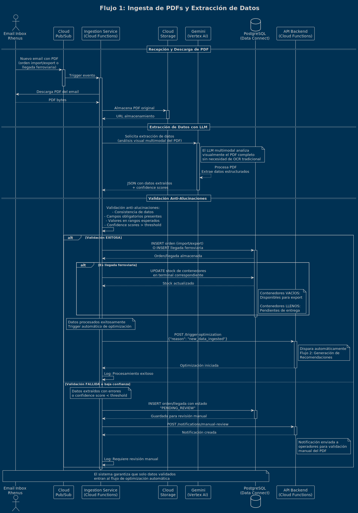
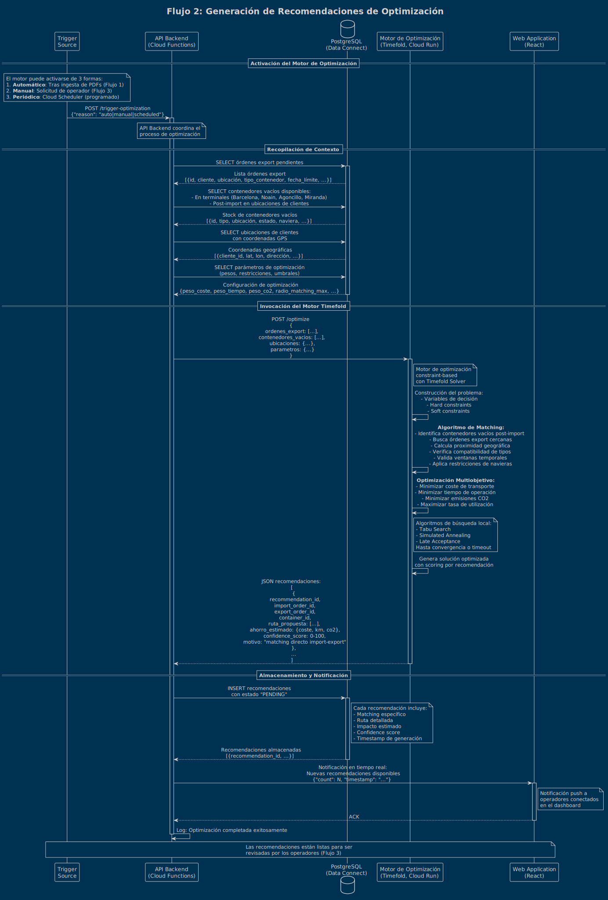
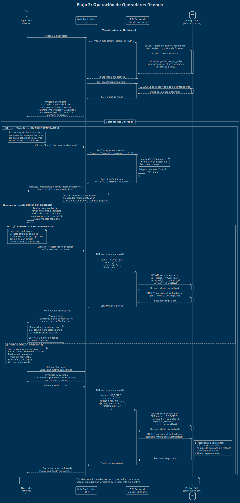

# Oferta Técnica - Rhenus Logistics

## Tabla de Contenidos

1. [Objetivos del proyecto](#1-objetivos-del-proyecto)
   - 1.1. [Contexto del problema](#11-contexto-del-problema)
   - 1.2. [Objetivos principales](#12-objetivos-principales)
   - 1.3. [Capacidades clave del sistema](#13-capacidades-clave-del-sistema)
   - 1.4. [Alcance del MVP](#14-alcance-del-mvp)
   - 1.5. [Modelo de operación del MVP](#15-modelo-de-operación-del-mvp)
   - 1.6. [Capacidades de análisis y visualización](#16-capacidades-de-análisis-y-visualización)
   - 1.7. [Supuestos e incógnitas del proyecto](#17-supuestos-e-incógnitas-del-proyecto)
2. [Alcance de la solución](#2-alcance-de-la-solución)
   - 2.1. [Visión general del sistema](#21-visión-general-del-sistema)
   - 2.2. [Componentes principales](#22-componentes-principales)
   - 2.3. [Perfiles de usuario](#23-perfiles-de-usuario)
   - 2.4. [Funcionalidades core](#24-funcionalidades-core)
   - 2.5. [Gestión de datos maestros](#25-gestión-de-datos-maestros)
   - 2.6. [Aspectos técnicos clave](#26-aspectos-técnicos-clave)
   - 2.7. [Funcionalidades fuera de alcance del MVP](#27-funcionalidades-fuera-de-alcance-del-mvp)
3. [Arquitectura técnica propuesta](#3-arquitectura-técnica-propuesta)
   - 3.1. [Visión general de la arquitectura](#31-visión-general-de-la-arquitectura)
   - 3.2. [Stack tecnológico](#32-stack-tecnológico)
   - 3.3. [Flujos de datos principales](#33-flujos-de-datos-principales)
   - 3.4. [Escalabilidad y rendimiento](#34-escalabilidad-y-rendimiento)
   - 3.5. [Seguridad](#35-seguridad)
   - 3.6. [Consideraciones de implementación](#36-consideraciones-de-implementación)
   - 3.7. [Diagramas de arquitectura](#37-diagramas-de-arquitectura)
4. [Tecnologías y herramientas](#4-tecnologías-y-herramientas)
   - 4.1. [Plataforma cloud y servicios core](#41-plataforma-cloud-y-servicios-core)
   - 4.2. [Frontend](#42-frontend)
   - 4.3. [Backend y APIs](#43-backend-y-apis)
   - 4.4. [Motor de optimización](#44-motor-de-optimización)
   - 4.5. [Bases de datos](#45-bases-de-datos)
   - 4.6. [Almacenamiento y mensajería](#46-almacenamiento-y-mensajería)
   - 4.7. [Autenticación, seguridad y secrets](#47-autenticación-seguridad-y-secrets)
   - 4.8. [Observabilidad y monitoring](#48-observabilidad-y-monitoring)
   - 4.9. [CI/CD y DevOps](#49-cicd-y-devops)
   - 4.10. [Testing y calidad](#410-testing-y-calidad)
   - 4.11. [Librerías y frameworks adicionales](#411-librerías-y-frameworks-adicionales)
   - 4.12. [Costes estimados de infraestructura cloud (MVP)](#412-costes-estimados-de-infraestructura-cloud-mvp)
5. [Riesgos y mitigación](#5-riesgos-y-mitigación)
   - 5.1. [Metodología de gestión de riesgos](#51-metodología-de-gestión-de-riesgos)
   - 5.2. [Riesgos de proyecto](#52-riesgos-de-proyecto)
   - 5.3. [Riesgos de negocio](#53-riesgos-de-negocio)
   - 5.4. [Riesgos de seguridad y cumplimiento](#54-riesgos-de-seguridad-y-cumplimiento)
   - 5.5. [Matriz de riesgos (probabilidad × impacto)](#55-matriz-de-riesgos-probabilidad--impacto)
   - 5.6. [Plan de comunicación de riesgos](#56-plan-de-comunicación-de-riesgos)

---

## 1. Objetivos del proyecto

### 1.1. Contexto del problema

El reposicionamiento de contenedores vacíos representa uno de los mayores desafíos en la industria logística:

| Indicador | Magnitud | Descripción |
|-----------|----------|-------------|
| **Coste global** | $20 billones anuales | Coste para la industria del transporte de contenedores |
| **Ineficiencia** | ~33% vacíos | Porcentaje de contenedores en circulación que están vacíos |
| **Tiempo inactivo** | ~50% vida útil | Tiempo que el contenedor promedio pasa inactivo |
| **Origen** | Desequilibrio comercial | Mercados orientados a importación vs exportación |

#### Flujos operativos de contenedores en Rhenus

> **⚠️ Nota:** Los flujos descritos a continuación están sujetos a confirmación con el cliente durante la fase de descubrimiento.

---

**Flujo IMPORT tradicional** (Contenedor lleno → Cliente → Devolución vacío)

```
Barcelona (LLENO) → TRUCK → Cliente → TRUCK → Terminal (VACÍO)
```

1. Contenedor **LLENO** llega a terminal marítima de Barcelona
2. Se recibe orden de import en PDF
3. `TRUCK` recoge contenedor lleno en Barcelona
4. `TRUCK` transporta contenedor a ubicación del cliente
5. Cliente descarga mercancía (contenedor queda **VACÍO**)
6. `TRUCK` devuelve contenedor vacío a terminal (puede ser Barcelona o terminal ferroviaria: Noain, Agoncillo, Miranda)

---

**Flujo EXPORT** (Contenedor vacío → Cliente → Puerto)

```
Terminal (VACÍO) → TRUCK → Cliente → TRUCK → Barcelona (LLENO)
```

1. Se recibe orden de export en PDF
2. `TRUCK` recoge contenedor **VACÍO** de una terminal (Barcelona o terminales ferroviarias: Noain, Agoncillo, Miranda)
3. `TRUCK` transporta contenedor vacío a ubicación del cliente
4. Cliente carga mercancía (contenedor queda **LLENO**)
5. `TRUCK` transporta contenedor lleno a terminal marítima de Barcelona
6. Contenedor se entrega en Barcelona para su envío marítimo

---

**Ciclo de distribución de contenedores vía TREN**

```
Barcelona → TREN → Terminal Ferroviaria (Noain/Agoncillo/Miranda)
```

1. Contenedores llegan a Barcelona vía marítima (import o contenedores vacíos de retorno)
2. Contenedores se envían mediante `TREN` desde Barcelona a terminales ferroviarias (Noain, Agoncillo, Miranda)
3. Se recibe PDF con información de contenedores que llegan a terminales ferroviarias
4. **Actualización de stock según estado:**
   - **Contenedores VACÍOS:** Disponibles para nuevas órdenes de export
   - **Contenedores LLENOS:** Pendientes de entrega a clientes en la zona (import)

#### El problema de ineficiencia actual y el valor del reposicionamiento inteligente

##### Situación SIN optimización (flujo tradicional separado)

*Para una operación IMPORT + EXPORT de clientes cercanos:*

**Import (Cliente A):**
```
1. Barcelona → Cliente A (LLENO) [TRUCK]
2. Cliente A descarga
3. Cliente A → Terminal (VACÍO) [TRUCK - viaje de devolución] ⚠️ EVITABLE
```

**Export (Cliente B cercano al Cliente A):**
```
4. Terminal → Cliente B (VACÍO) [TRUCK - viaje de recogida] ⚠️ EVITABLE
5. Cliente B carga
6. Cliente B → Barcelona (LLENO) [TRUCK]
```

**Total: 6 viajes**
- 2 viajes útiles con carga (1 lleno import, 1 lleno export)
- 4 viajes con contenedores vacíos o retornos
- **2 viajes completamente EVITABLES** (devolución vacío + recogida vacío)

---

##### Situación CON optimización (matching import-export)

*Misma operación IMPORT + EXPORT con matching inteligente:*

**Import + Export optimizado:**
```
1. Barcelona → Cliente A (LLENO) [TRUCK]
2. Cliente A descarga (contenedor queda vacío)
3. Cliente A → Cliente B (VACÍO) [TRUCK - reposicionamiento directo] ✨ OPTIMIZADO
4. Cliente B carga
5. Cliente B → Barcelona (LLENO) [TRUCK]
```

**Total: 5 viajes**
- 2 viajes útiles con carga (1 lleno import, 1 lleno export)
- **3 viajes necesarios** (solo 1 vacío entre clientes cercanos)

---

##### Valor del reposicionamiento inteligente

| Métrica | Beneficio |
|---------|-----------|
| **Viajes eliminados** | 1 viaje (33% menos viajes vs. flujo tradicional) |
| **Se elimina** | Viaje vacío Cliente A → Terminal + Viaje vacío Terminal → Cliente B |
| **Se añade** | Solo 1 viaje vacío Cliente A → Cliente B (distancia mucho menor) |
| **Ahorro real** | Kilómetros, combustible, tiempo, coste operativo |
| **Reducción emisiones** | Menos CO₂ por kilómetros evitados |
| **Mejora utilización** | Contenedor pasa menos tiempo inactivo en terminal |

---

##### Problemática actual de Rhenus Logistics

Rhenus Logistics actualmente dispone de un sistema TMS que **no cubre adecuadamente** esta optimización del uso de contenedores vacíos, generando:

- Costes innecesarios de reposicionamiento de contenedores vacíos
- Retornos a terminal de contenedores que podrían reutilizarse directamente
- Falta de visibilidad sobre oportunidades de matching import-export
- Emisiones evitables de CO₂ por transporte de contenedores vacíos

### 1.2. Objetivos principales

El proyecto tiene como objetivo desarrollar un **MVP (Minimum Viable Product)** de un sistema TMS avanzado con capacidades de IA que permita:

#### 1.2.1. Reducción de costes operativos

- Minimizar transportes de contenedores vacíos mediante matching inteligente
- Reducir retornos innecesarios a terminal
- Optimizar el uso de la flota de contenedores disponible

#### 1.2.2. Maximización de utilización de contenedores

- Aumentar el tiempo activo de los contenedores (reducir inactividad del 50% actual)
- Conectar directamente contenedores de importación con necesidades de exportación
- Mejorar la rotación y disponibilidad del stock de contenedores

#### 1.2.3. Sostenibilidad ambiental

- Reducir emisiones de CO₂ mediante optimización de rutas
- Minimizar kilómetros en vacío
- Contribuir a objetivos de sostenibilidad corporativa

#### 1.2.4. Optimización multimodal

**Planificación inteligente de rutas considerando dos modos de transporte:**

| Modo | Uso |
|------|-----|
| `TRAIN` (ferroviario) | Para trayectos entre Barcelona y terminales ferroviarias (Noain, Agoncillo, Miranda) |
| `TRUCK` (carretera) | Para primeros/últimos tramos y trayectos completos |

**Características:**
- Optimización multiobjetivo: coste, tiempo, emisiones y disponibilidad
- Coordinación eficiente entre ambos medios de transporte

### 1.3. Capacidades clave del sistema

El sistema deberá incorporar las siguientes capacidades de optimización e inteligencia artificial:

#### 1. Matching inteligente import-export

Identificar automáticamente oportunidades de reutilización directa de contenedores:

- ✅ Contenedor de **import** que queda vacío en ubicación del cliente
- ✅ Orden de **export** de un cliente cercano que necesita contenedor vacío
- ❌ Evitar retorno del contenedor vacío a terminal
- ❌ Evitar viaje de recogida de contenedor vacío desde terminal

**Factores de análisis:**
- Proximidad geográfica entre clientes
- Compatibilidad de tipos de contenedores y requisitos
- Ventanas temporales de disponibilidad

#### 2. Predicción de demanda

- Anticipar necesidades futuras de contenedores por ruta, cliente y tipo
- Facilitar planificación proactiva del stock de contenedores

#### 3. Optimización de rutas multiobjetivo

**Algoritmos que consideren simultáneamente:**

| Objetivo | Descripción |
|----------|-------------|
| **Coste** | Minimizar costes de transporte |
| **Tiempo** | Optimizar tiempo de tránsito |
| **Emisiones CO₂** | Reducir huella de carbono |
| **Disponibilidad** | Maximizar uso de recursos disponibles |

**Características:**
- Soporte para rutas multimodales (combinación de `TRAIN` y `TRUCK`)
- Consideración de restricciones geográficas (terminales: Barcelona, Noain, Agoncillo, Miranda)

#### 4. Alertas y recomendaciones proactivas

- Notificaciones automáticas de oportunidades de optimización
- Sugerencias inteligentes para mejorar eficiencia operativa

### 1.4. Alcance del MVP

| Dimensión | Alcance |
|-----------|---------|
| **Geográfico** | Operaciones de Rhenus Logistics en la zona norte de España:<br>• **Bilbao:** Centro de gestión de órdenes<br>• **Barcelona:** Puerto marítimo<br>• **Depots/Estaciones ferroviarias:** Noain, Agoncillo y Miranda |
| **Modos de transporte** | `TRAIN` (ferroviario) y `TRUCK` (carretera) |
| **Integración inicial** | Sistema de ingesta vía inbox de correo electrónico para procesar PDFs:<br>• PDFs con órdenes de import/export<br>• PDFs con información de llegadas de contenedores (vacíos o llenos) vía tren a terminales ferroviarias |
| **Datos** | Stock de contenedores y datos maestros precargados en el sistema para validación inicial |
| **Enfoque** | Desarrollo iterativo para validar el concepto antes de escalar a otras zonas geográficas y modos de transporte |

### 1.5. Modelo de operación del MVP

#### Sistema de recomendaciones para operadores

El MVP funcionará como un **sistema de apoyo a la decisión** que proporciona sugerencias inteligentes a los operadores de Rhenus, manteniendo el control humano en la toma de decisiones:

**Características del modelo:**

| Aspecto | Descripción |
|---------|-------------|
| **Sugerencias, no automatización** | El sistema analizará las órdenes de import/export y generará recomendaciones sobre movimientos óptimos de contenedores, pero serán los operadores quienes decidan ejecutarlas o no |
| **Sin integración con sistemas de ejecución** | El MVP **NO se integrará** con ningún sistema externo que genere automáticamente órdenes de transporte |
| **Flujo manual validado** | Los operadores revisarán las sugerencias del sistema y, si las aprueban, procederán a generar las órdenes de transporte a través de sus procesos actuales |
| **Aprendizaje iterativo** | El feedback de los operadores sobre las sugerencias aceptadas/rechazadas servirá para mejorar el modelo en futuras iteraciones |

**Beneficios de este enfoque:**

1. Validar la precisión y utilidad de las recomendaciones antes de cualquier automatización
2. Mantener el conocimiento y experiencia de los operadores en el proceso
3. Minimizar riesgos operativos durante la fase de prueba
4. Generar confianza en el sistema antes de escalar

### 1.6. Capacidades de análisis y visualización

El MVP incorporará funcionalidades de análisis y visualización que permitan tanto a operadores como a la dirección de negocio evaluar el estado actual y la efectividad del sistema:

#### 1.6.1. Visualización de stock de contenedores

El sistema proporcionará visibilidad completa del ciclo de vida de contenedores:

- **Contenedores en terminales:**
  - Stock de contenedores en:
    - **Terminales ferroviarias:** Noain, Agoncillo y Miranda (actualizados con PDFs de llegadas de tren)
      - Contenedores **VACÍOS**: Disponibles para órdenes de export
      - Contenedores **LLENOS**: Pendientes de entrega a clientes (import)
    - **Barcelona:** Terminal marítima
      - Contenedores vacíos devueltos de operaciones import
      - Contenedores llenos de importación marítima
  - Disponibles para ser asignados según estado y operación

- **Contenedores en tránsito (en rutas activas):**
  - **Import en curso:** Contenedores llenos en ruta desde Barcelona hacia clientes
  - **Export en curso:** Contenedores en ruta desde terminales/clientes hacia Barcelona

- **Contenedores post-import (vacíos en ubicaciones de clientes):**
  - Contenedores que han completado entregas de import y están vacíos en ubicación del cliente
  - **Candidatos para matching:** Disponibles para ser reutilizados en órdenes de export cercanas
  - Visualización de tiempo desde que quedaron vacíos
  - Proximidad a órdenes de export pendientes

- **Distribución geográfica:** Mapa de la zona norte mostrando:
  - Terminales ferroviarias con stock de vacíos (Noain, Agoncillo, Miranda)
  - Barcelona (terminal marítima)
  - Ubicaciones de clientes con contenedores vacíos post-import
  - Ubicaciones de clientes con órdenes de export pendientes
  - Oportunidades de matching visualizadas geográficamente
  - Centro de gestión en Bilbao (sin stock físico de contenedores)

- **Estados y tipos:** Clasificación por:
  - Tipo de contenedor (22G1=20'DV, 42G1=40'DV, 45G1=40'HC)
  - Estado (vacío en terminal, vacío en cliente, lleno en tránsito, etc.)
  - Disponibilidad y restricciones

#### 1.6.2. Métricas de efectividad del sistema

El sistema proporcionará indicadores clave (KPIs) para que el negocio pueda evaluar el retorno de la inversión:

---

**Métricas de optimización:**

| KPI | Descripción |
|-----|-------------|
| **% de matching import-export exitoso** | Porcentaje de contenedores de import reutilizados directamente para export (sin retorno a terminal) |
| **Viajes evitados** | Número de viajes de retorno a terminal y recogidas desde terminal eliminados |
| **Reducción de kilómetros totales** | Kilómetros ahorrados por matching directo vs. ruta tradicional |
| **Reducción de km en vacío** | Kilómetros específicamente evitados de transporte de contenedores vacíos |
| **Tiempo de inactividad** | Tiempo promedio que un contenedor permanece inactivo entre operaciones |
| **Tasa de utilización** | Porcentaje de tiempo que contenedores están en uso activo vs. inactivos |

---

**Métricas de adopción:**

| KPI | Descripción |
|-----|-------------|
| **% de aceptación de sugerencias** | Porcentaje de recomendaciones aceptadas vs. rechazadas por operadores |
| **Tiempo de respuesta** | Tiempo medio de respuesta a las recomendaciones |
| **Motivos de rechazo** | Análisis de razones para mejora continua del algoritmo |

---

**Métricas de impacto económico y ambiental:**

| KPI | Descripción |
|-----|-------------|
| **Ahorro de costes** | Ahorro estimado en costes de reposicionamiento |
| **Reducción CO₂** | Reducción estimada de emisiones de carbono |
| **ROI proyectado** | Retorno de inversión del sistema |

#### 1.6.3. Dashboard analítico
Interface visual que consolide toda la información relevante para la toma de decisiones y evaluación del sistema.

### 1.7. Supuestos e incógnitas del proyecto

> **⚠️ Importante:** Es importante reconocer que existen aspectos del proceso actual de Rhenus que aún deben ser definidos y que se resolverán durante la ejecución del proyecto.

---

#### Incógnitas a resolver

| Área | Preguntas pendientes |
|------|---------------------|
| **Procedimiento actual de asignación** | • ¿Cómo gestiona actualmente Rhenus la asignación de contenedores a rutas?<br>• ¿Qué criterios se utilizan?<br>• ¿Quiénes son los responsables?<br>• ¿Qué herramientas se utilizan? |
| **Reglas de negocio específicas** | • ¿Qué restricciones existen?<br>• ¿Hay prioridades de clientes?<br>• ¿Qué acuerdos comerciales afectan la asignación de contenedores? |
| **Fuentes de datos existentes** | • ¿Qué datos están disponibles actualmente?<br>• ¿En qué formato están?<br>• ¿Cuál es el nivel de calidad de los datos? |
| **Procesos de coordinación** | • ¿Cómo se coordinan las diferentes delegaciones?<br>• ¿Cómo se gestionan los modos de transporte? |

---

#### Enfoque de resolución

Estas incógnitas se abordarán mediante:

| Fase | Actividades |
|------|-------------|
| **Fase de descubrimiento inicial** | Sesiones de trabajo con operadores y responsables de Rhenus para mapear procesos actuales |
| **Desarrollo iterativo** | El MVP se irá ajustando según el conocimiento adquirido durante el proyecto |
| **Colaboración continua** | Comunicación frecuente con el equipo de Rhenus para validar supuestos y ajustar la solución |

---

## 2. Alcance de la solución

### 2.1. Visión general del sistema

El MVP consistirá en una **plataforma web de apoyo a la decisión** que permita a los operadores de Rhenus Logistics optimizar el uso de contenedores mediante recomendaciones inteligentes basadas en IA. El sistema incluirá capacidades de análisis, visualización y gestión de datos maestros.

### 2.2. Componentes principales

El sistema estará compuesto por los siguientes módulos:

---

#### 1. Motor de ingesta de datos

**Funcionalidades:**
- Monitorización automática de inbox de correo electrónico
- Extracción automática de datos de PDFs mediante **LLMs multimodales**:
  - Análisis visual de documentos PDF
  - Extracción y estructuración de datos en formato estándar (`JSON`)
  - Procesamiento de órdenes de import/export
  - Procesamiento de llegadas de contenedores (vacíos o llenos) vía tren a terminales ferroviarias
- Procesamiento en tiempo real o near-real-time
- Sistema de validación para detección de inconsistencias y alucinaciones del modelo
- Alertas en caso de errores o baja confianza en la extracción
- Actualización automática de stock en depots (diferenciando contenedores vacíos y llenos)

---

#### 2. Motor de optimización y recomendaciones

**Capacidades:**
- Algoritmos de matching inteligente import-export
- Optimización multiobjetivo (coste, tiempo, emisiones CO₂, disponibilidad)
- Predicción de demanda futura de contenedores
- Cálculo de rutas multimodales óptimas (`TRAIN` + `TRUCK`)
- Generación de nivel de confianza para cada recomendación

---

#### 3. Interface de usuario web responsive

**Características:**
- Accesible desde navegadores en desktop y tablets
- Gestión de recomendaciones (revisión, aceptación/rechazo)
- Visualización de órdenes activas y planificadas
- Gestión de datos maestros

---

#### 4. Dashboard analítico

**Funcionalidades:**
- Visualización de KPIs en tiempo real
- Reportes de efectividad del sistema
- Análisis de tendencias y patrones

---

#### 5. Módulo de gestión de datos maestros

**Administración de:**
- Contenedores, terminales, rutas, clientes, navieras
- Configuración de parámetros de optimización
- Gestión de usuarios y permisos

### 2.3. Perfiles de usuario

El sistema contemplará diferentes niveles de acceso y funcionalidades según el rol del usuario:

> **⚠️ Nota:** Los perfiles específicos de usuario se definirán con mayor detalle durante la fase de descubrimiento del proyecto.

---

#### 1. Usuarios con capacidad de decisión

| Permiso | Descripción |
|---------|-------------|
| **Visualización** | Recomendaciones de optimización |
| **Gestión** | Aceptación/rechazo de sugerencias con justificación |
| **Consulta** | Estado de contenedores y rutas |
| **Ejecución** | Generación de órdenes de transporte (fuera del sistema, en sus procesos actuales) |

---

#### 2. Usuarios de visualización (solo lectura)

| Permiso | Descripción |
|---------|-------------|
| **Consulta de estado** | Estado de contenedores |
| **Visualización de rutas** | Rutas planificadas y en curso |
| **Reportes** | Acceso a reportes y dashboards |

---

#### 3. Administradores del sistema

| Función | Descripción |
|---------|-------------|
| **Configuración de inbox** | Setup del correo de ingesta de PDFs |
| **Optimización** | Ajuste de pesos y criterios de optimización |
| **Datos maestros** | Gestión de contenedores, terminales, navieras, clientes, rutas, tarifas |
| **Usuarios** | Administración de usuarios y permisos |
| **Parámetros** | Configuración de parámetros del sistema |

### 2.4. Funcionalidades core

#### 2.4.1. Procesamiento automático de datos

El sistema procesará dos tipos de PDFs recibidos en el inbox utilizando **LLMs multimodales** para la extracción de información:

**Tecnología de Extracción:**
- **LLMs multimodales:** Modelos de lenguaje con capacidad de análisis visual de documentos
- **Análisis visual:** Lectura e interpretación del contenido del PDF sin necesidad de OCR tradicional
- **Estructuración en JSON:** Extracción de datos y conversión automática a formato estándar JSON
- **Validación anti-alucinaciones:** Sistema de validación para detectar:
  - Inconsistencias en los datos extraídos
  - Posibles alucinaciones del modelo LLM
  - Campos extraídos con baja confianza
  - Valores fuera de rangos esperados

**A) PDFs de Órdenes Import/Export**

El sistema procesará dos tipos de órdenes con diferentes flujos:

---

##### Órdenes de IMPORT (Contenedor lleno → Cliente → Devolución vacío)

**Datos extraídos mediante LLM multimodal:**

| Campo | Descripción |
|-------|-------------|
| Cliente | Destinatario de la mercancía |
| Ubicación del cliente | Destino de entrega |
| Tipo y cantidad de contenedores | `22G1`, `42G1`, `45G1` |
| Fecha/hora recogida | En Barcelona (terminal marítima) |
| Fecha/hora entrega | Estimada en ubicación del cliente |
| Requisitos especiales | Condiciones del contenedor o mercancía |
| Naviera propietaria | Maersk, Hapag-Lloyd, MSC, etc. |
| Terminal de devolución preferida | Barcelona, Noain, Agoncillo o Miranda |

**Flujos operativos:**

```
Flujo tradicional:
Barcelona (lleno) → TRUCK → Cliente (descarga, vacío) → TRUCK → Terminal

Flujo optimizado (con matching):
Barcelona (lleno) → TRUCK → Cliente A (descarga, vacío) → TRUCK → Cliente B export
```

> **Estado relevante para matching:** Contenedor vacío disponible en ubicación del cliente después de descarga

---

##### Órdenes de EXPORT (Cliente → Contenedor lleno → Barcelona)

**Datos extraídos mediante LLM multimodal:**

| Campo | Descripción |
|-------|-------------|
| Cliente | Origen de la mercancía |
| Ubicación del cliente | Punto de recogida de contenedor vacío |
| Tipo y cantidad de contenedores | Contenedores requeridos |
| Fecha/hora recogida | En ubicación del cliente |
| Fecha/hora límite entrega | En Barcelona (terminal marítima) |
| Requisitos especiales | Condiciones del contenedor o mercancía |
| Naviera de destino | Compañía naviera para el envío |
| Terminal de recogida preferida | Barcelona, Noain, Agoncillo o Miranda |

**Flujos operativos:**

```
Flujo tradicional:
Terminal (Barcelona o ferroviaria) → TRUCK → Cliente (carga, lleno) → TRUCK → Barcelona

Flujo optimizado (con matching):
Usar contenedor vacío de import cercano → TRUCK → Cliente → TRUCK → Barcelona
```

---

**Salida común del procesamiento:**

- Datos estructurados en formato `JSON`
- **Validación:** Detección de inconsistencias y alucinaciones del modelo
- **Notificaciones:** Alertas a usuarios cuando se requiere intervención manual o validación humana

**B) PDFs de llegadas de contenedores ferroviarios**

Estos PDFs contienen información sobre contenedores (tanto **VACÍOS** como **LLENOS**) que llegan mediante `TREN` desde Barcelona a las terminales ferroviarias.

---

**Contexto de los flujos:**

| Tipo | Flujo del ciclo |
|------|-----------------|
| **Contenedores VACÍOS** | 1. Contenedores export enviados por mar desde Barcelona<br>2. Contenedores vacíos regresan a Barcelona (gestionados por navieras)<br>3. Se envían con `TREN` desde Barcelona a terminales ferroviarias<br>4. PDF informa de la llegada de contenedores vacíos<br>5. Quedan **disponibles para nuevas órdenes de export** |
| **Contenedores LLENOS** | 1. Contenedores llenos llegan a Barcelona vía marítima (importación)<br>2. Se envían con `TREN` desde Barcelona a terminales ferroviarias<br>3. PDF informa de la llegada de contenedores llenos<br>4. **Disponibles para entrega a clientes en la zona** |

---

**Datos extraídos mediante LLM multimodal:**

| Campo | Descripción |
|-------|-------------|
| Terminal ferroviaria de destino | Noain, Agoncillo o Miranda |
| Identificación de contenedores | IDs únicos de los contenedores |
| Tipo y características | `22G1`, `42G1`, `45G1` |
| Fecha y hora de llegada | Timestamp de llegada a terminal |
| **Estado del contenedor** | **VACÍO** o **LLENO** |
| Naviera propietaria | Compañía propietaria del contenedor |
| Si está lleno | Cliente destinatario o referencia de orden de import |

---

**Procesamiento y actualización:**

- **Salida:** Datos estructurados en formato `JSON`
- **Validación:** Verificación de consistencia de datos extraídos
- **Actualización de stock:** Actualización automática del inventario en el depot correspondiente según estado:
  - **Contenedores VACÍOS:** Disponibles para órdenes de export
  - **Contenedores LLENOS:** Pendientes de entrega a clientes
- **Notificaciones:** Alertas sobre nuevas llegadas y disponibilidad de contenedores

#### 2.4.2. Motor de recomendaciones de optimización

El sistema generará recomendaciones inteligentes de matching import-export para optimizar el uso de contenedores vacíos.

**Tipos de recomendaciones:**

**1. Matching directo import → export (optimización principal):**
- **Situación detectada:**
  - Orden de IMPORT: Contenedor lleno entregado al Cliente A, después de descarga quedará vacío
  - Orden de EXPORT: Cliente B en ubicación cercana al Cliente A necesita contenedor vacío
- **Recomendación:**
  - Usar el contenedor vacío del import del Cliente A directamente para el export del Cliente B
  - Evitar devolución del vacío a terminal (Barcelona o terminal ferroviaria)
  - Evitar recogida de vacío desde terminal (Barcelona o terminal ferroviaria)

- **Comparación de rutas:**
  - **SIN optimización (tradicional):**
    1. Barcelona → Cliente A (lleno) - Import
    2. Cliente A → Terminal (vacío) - Devolución
    3. Terminal → Cliente B (vacío) - Recogida export
    4. Cliente B → Barcelona (lleno) - Export
    - **Total:** 4 viajes

  - **CON optimización (matching):**
    1. Barcelona → Cliente A (lleno) - Import
    2. Cliente A → Cliente B (vacío) - Reposicionamiento directo
    3. Cliente B → Barcelona (lleno) - Export
    - **Total:** 3 viajes

  - **Ahorro:** 1 viaje eliminado (25% reducción)
  - **Detalle:** Se eliminan los viajes Cliente A → Terminal + Terminal → Cliente B
  - **Se añade:** Solo el viaje directo Cliente A → Cliente B (típicamente distancia mucho menor)

**2. Recogida de contenedor vacío optimizada:**
- Cuando no hay matching directo import-export disponible
- Seleccionar la terminal óptima para recoger contenedor vacío:
  - Barcelona (terminal marítima)
  - Noain, Agoncillo o Miranda (terminales ferroviarias)
- Considerar proximidad al cliente export, disponibilidad de stock en cada terminal, y costes de transporte

**Información incluida en cada recomendación:**

- **Matching específico:**
  - ID de orden de import (contenedor que quedará vacío)
  - ID de orden de export (que necesita contenedor vacío)
  - Ubicaciones de clientes y distancia entre ellos
  - Compatibilidad de tipos de contenedores

- **Ruta propuesta detallada:**
  - Secuencia de movimientos paso a paso
  - Modo de transporte en cada tramo (**TRUCK**)
  - Puntos de origen, intermedios y destino
  - Tiempos estimados por tramo

- **Impacto estimado vs. ruta tradicional:**
  - Ahorro económico (coste de transporte evitado)
  - Kilómetros evitados
  - Reducción de emisiones de CO2
  - Tiempo total de operación
  - Número de viajes/tramos eliminados

- **Nivel de confianza:**
  - Score (0-100%) que indica la fiabilidad de la recomendación
  - Factores considerados: proximidad geográfica, compatibilidad de contenedores, ventanas temporales, restricciones

**Estrategia de generación de recomendaciones:**

El sistema podrá operar en tiempo real al recibir nuevas órdenes, generando sugerencias inmediatamente.

**Incógnita a resolver durante el proyecto:** La estrategia de replanificación ante nuevas órdenes, modificaciones o cancelaciones aún debe definirse con Rhenus:
- ¿Replanificar todas las órdenes pendientes o solo la nueva?
- ¿Cómo gestionar recomendaciones ya aceptadas pero no ejecutadas cuando llega nueva información?
- ¿Qué ventana temporal considerar para replanificación?

#### 2.4.3. Gestión de feedback de recomendaciones

- **Aceptación/Rechazo:** Interface para que usuarios indiquen si aceptan o rechazan cada sugerencia
- **Motivos de rechazo:** Captura de razones para retroalimentar el modelo
- **Tracking de ejecución:** Registro de qué recomendaciones aceptadas fueron realmente ejecutadas
- **Aprendizaje continuo:** Uso del feedback para mejorar futuras recomendaciones

#### 2.4.4. Visualización de stock y estado de contenedores

El sistema proporcionará múltiples vistas para entender el estado completo del inventario de contenedores:

**Vista por estados del ciclo de vida:**

1. **Contenedores en terminales:**
   - **Terminales ferroviarias:** Noain, Agoncillo, Miranda
     - Stock actualizado automáticamente con PDFs de llegadas de tren
     - **VACÍOS:** Disponibles para órdenes de export
     - **LLENOS:** Pendientes de entrega a clientes (import)
   - **Barcelona:** Terminal marítima
     - Contenedores vacíos devueltos de operaciones import
     - Contenedores llenos de importación marítima
   - Cantidad por tipo de contenedor (22G1, 42G1, 45G1) y estado en cada ubicación
   - Tiempo de permanencia en terminal

2. **Contenedores post-import (vacíos en ubicaciones de clientes):**
   - **Vista crítica para matching:** Contenedores que completaron entregas de import
   - Ubicación del cliente donde quedaron vacíos
   - Tiempo transcurrido desde que quedaron vacíos
   - Indicador de proximidad a órdenes de export pendientes
   - Destacado visual de oportunidades de matching

3. **Contenedores en tránsito:**
   - **Import activo:** Llenos desde Barcelona hacia clientes
   - **Export activo:** Desde ubicación origen (terminal o cliente) hacia Barcelona
   - Modo de transporte actual (TRUCK)
   - Progreso estimado de la ruta

**Mapa geográfico interactivo:**
- **Terminales con stock de vacíos:**
  - Terminales ferroviarias (Noain, Agoncillo, Miranda) con nivel de stock
  - Barcelona (terminal marítima) con nivel de stock de vacíos devueltos
- Clientes con contenedores vacíos post-import (pins en mapa)
- Clientes con órdenes de export pendientes (pins en mapa)
- **Visualización de oportunidades:** Líneas conectando contenedores vacíos en clientes con órdenes de export cercanas
- Rutas activas en tiempo real

**Filtros y búsquedas:**
- Por tipo de contenedor (22G1=20'DV, 42G1=40'DV, 45G1=40'HC)
- Por ubicación (Barcelona, Noain, Agoncillo, Miranda, ubicaciones de clientes)
- Por estado (vacío en terminal, vacío en cliente, lleno en tránsito, etc.)
- Por disponibilidad temporal
- Por propietario/naviera
- Por edad (tiempo desde última operación)

#### 2.4.5. Dashboard y métricas

Paneles visuales con los KPIs definidos en la sección 1.6.2:
- Métricas de optimización
- Métricas de adopción del sistema
- Métricas de impacto económico y ambiental
- Gráficos de tendencias temporales
- Comparativas antes/después de usar el sistema

### 2.5. Gestión de datos maestros

El sistema permitirá administrar la siguiente información:

> **⚠️ Nota:** Durante el proyecto se definirá qué datos son verdaderamente maestros (editables) y cuáles son paramétricos de solo lectura.

---

#### 1. Contenedores

**Tipos de contenedores (códigos ISO):**

| Código ISO | Descripción | Dimensiones |
|------------|-------------|-------------|
| `22G1` | 20'DV | 20 pies Dry Van |
| `42G1` | 40'DV | 40 pies Dry Van |
| `45G1` | 40'HC | 40 pies High Cube |

**Información del contenedor:**

| Atributo | Descripción |
|----------|-------------|
| Inventario completo | Registro de todos los contenedores disponibles |
| Capacidades y características | Especificaciones técnicas por tipo |
| **Naviera dueña** | Campo **crítico** - propietario del contenedor (Maersk, Hapag-Lloyd, MSC, etc.) |
| Ubicación actual | Terminal (Barcelona, Noain, Agoncillo, Miranda) o cliente |
| Historial de operaciones | Última import/export realizada |

**Estados posibles del contenedor:**

| Estado | Descripción | Disponibilidad |
|--------|-------------|----------------|
| **Vacío en terminal** | Barcelona o ferroviarias (Noain/Agoncillo/Miranda) | ✅ Disponible para export |
| **Vacío en cliente post-import** | En ubicación del cliente tras descarga | ✅ Candidato para matching |
| **Lleno en tránsito import** | Barcelona → Cliente | En operación |
| **En tránsito export** | Cliente/Terminal → Barcelona | En operación |
| **En tránsito devolución** | Cliente → Terminal (vacío) | En retorno |
| **En mantenimiento** | Fuera de servicio | ❌ No disponible |

#### 2. Depots/terminales

| Terminal | Tipo | Funcionalidades |
|----------|------|-----------------|
| **Barcelona** | Terminal marítima (puerto) | • Recepción de contenedores llenos de importación<br>• Almacenamiento de contenedores vacíos devueltos de operaciones import<br>• Envío de contenedores llenos de exportación |
| **Noain, Agoncillo, Miranda** | Terminales ferroviarias | • Recepción de contenedores vía `TREN` desde Barcelona (vacíos o llenos)<br>• Almacenamiento de contenedores vacíos disponibles para export<br>• Almacenamiento de contenedores llenos pendientes de entrega a clientes (import) |

**Información adicional por terminal:**
- Capacidades de almacenamiento por ubicación
- Tipos de contenedores soportados en cada terminal
- Costes de almacenamiento
- Operadores y horarios de operación

---

#### 3. Clientes

| Atributo | Descripción | Criticidad |
|----------|-------------|------------|
| Información básica | Nombre, identificación | Obligatorio |
| **Ubicaciones geográficas** | Coordenadas GPS o dirección completa | **Crítico** para cálculo de proximidad y matching |
| Tipos de contenedores habituales | Contenedores que maneja regularmente | Recomendado |
| Restricciones especiales | Requisitos específicos del cliente | Opcional |
| Historial de operaciones | Registro de import/export previas | Analítica |

---

#### 4. Rutas y tarifas

**Costes de transporte `TRUCK`:**

| Ruta | Descripción |
|------|-------------|
| Entre terminales | Barcelona ↔ Noain/Agoncillo/Miranda |
| Terminal → Cliente | Desde terminales a ubicaciones de clientes |
| Cliente → Cliente | Para matching import-export directo |

**Tiempos estimados de tránsito:**

| Modo | Aplicación |
|------|------------|
| `TRAIN` | Rutas ferroviarias entre Barcelona y terminales ferroviarias |
| `TRUCK` | Rutas por carretera (terminales, clientes) |

**Información adicional:**
- Restricciones de capacidad por modo de transporte
- Frecuencias de servicio ferroviario
- Matriz de distancias para cálculo de proximidad

---

#### 5. Navieras

> **⚠️ Importante:** Las navieras son las **ÚNICAS propietarias** de los contenedores

**Principales navieras:**
- Maersk
- Hapag-Lloyd
- Mediterranean Shipping Company (MSC)
- Otros operadores internacionales

**Información gestionada:**

| Aspecto | Descripción |
|---------|-------------|
| Acuerdos comerciales | Contratos con Rhenus |
| Condiciones de uso | Políticas de uso de contenedores |
| Políticas de reposicionamiento | Restricciones específicas por naviera |
| Tarifas por uso | Costes de utilización de contenedores |
| Free time | Tiempo gratuito de uso del contenedor |

---

#### 6. Parámetros de optimización

**Pesos de criterios de optimización:**

| Criterio | Propósito |
|----------|-----------|
| Coste | Minimizar costes operativos |
| Tiempo | Optimizar tiempos de tránsito |
| CO₂ | Reducir emisiones de carbono |

**Parámetros de matching:**

| Parámetro | Descripción |
|-----------|-------------|
| **Radio máximo de matching** | Distancia máxima entre cliente import y cliente export para considerar matching directo |
| **Ventana temporal de matching** | Tiempo máximo entre disponibilidad de contenedor vacío y necesidad de export |

**Otros parámetros:**
- Restricciones de negocio específicas
- Umbrales de alertas y notificaciones
- Configuración del motor de IA (confidence threshold, etc.)

### 2.6. Aspectos técnicos clave

| Aspecto | Especificación |
|---------|----------------|
| **Arquitectura** | Cloud-native, escalable y modular |
| **Disponibilidad** | Alta disponibilidad durante horario laboral |
| **Rendimiento** | Procesamiento de órdenes en near-real-time (< 5 minutos desde recepción) |
| **Seguridad** | Autenticación, autorización basada en roles (RBAC), cifrado de datos sensibles |
| **Trazabilidad** | Auditoría completa de acciones de usuarios y decisiones del sistema |

### 2.7. Funcionalidades fuera de alcance del MVP

> Para mantener el foco en la validación del concepto, las siguientes funcionalidades quedan **explícitamente fuera del alcance** de este MVP:

| Categoría | Funcionalidades excluidas |
|-----------|---------------------------|
| **Integraciones** | • Integración automática con sistemas externos (ERP, TMS existente, sistemas de navieras)<br>• Generación automática de órdenes de transporte<br>• APIs públicas para terceros |
| **Aplicaciones móviles** | • Aplicación móvil nativa |
| **Tracking y sensores** | • Tracking GPS en tiempo real de contenedores<br>• Integración con IoT/sensores |
| **Funcionalidades adicionales** | • Módulo de facturación<br>• Portal de clientes externos |

---

## 3. Arquitectura técnica propuesta

### 3.1. Visión general de la arquitectura

El MVP se desarrollará utilizando una arquitectura **cloud-native en Google Cloud Platform (GCP)**, combinando servicios de Firebase para desarrollo rápido con componentes especializados desplegados en GCP. El enfoque es **serverless-first** para minimizar overhead operativo y costes en la fase de MVP.

### 3.2. Stack tecnológico

#### 3.2.1. Cloud provider

| Componente | Tecnología |
|------------|------------|
| **Proveedor principal** | `Google Cloud Platform (GCP)` |
| **Ventaja clave** | Ecosistema integrado de servicios de Google |

---

#### 3.2.2. Frontend

| Componente | Tecnología | Beneficio |
|------------|------------|-----------|
| **Framework** | `Vite` + `React` + `TypeScript` | Builds rápidos, componentes reutilizables, type safety |
| **Hosting** | `Firebase Hosting` | CDN global, SSL automático, despliegue simple |

**Stack detallado:**
- **Vite:** Builds rápidos y desarrollo ágil con HMR optimizado
- **React:** Framework UI maduro con ecosistema rico
- **TypeScript:** Type safety y mejor mantenibilidad del código

---

#### 3.2.3. Backend

**`Node.js Cloud Functions`** para lógica de negocio ligera

**Funcionalidades:**
- Procesamiento de webhooks/eventos
- Orquestación de servicios
- APIs REST para frontend
- Integraciones con servicios externos

**Ventaja:** Serverless - Escala automáticamente según demanda

---

#### 3.2.4. Motor de optimización

| Aspecto | Tecnología/Detalle |
|---------|-------------------|
| **Lenguaje** | `Java` |
| **Framework** | `Timefold` (evolución de OptaPlanner) |
| **Deployment** | `Cloud Run` (contenedor serverless) |
| **Ventajas** | • Constraint-based optimization<br>• Ideal para problemas de routing y scheduling<br>• Optimización multiobjetivo<br>• Algoritmos avanzados de búsqueda local<br>• Pago por uso (solo cuando se ejecutan optimizaciones) |

---

#### 3.2.5. Machine learning / predicción (si necesario)

| Aspecto | Tecnología |
|---------|------------|
| **Lenguaje** | `Python` |
| **Despliegue** | `Cloud Functions` o `Cloud Run` |
| **Uso** | Predicción de demanda de contenedores (si se implementa) |

---

#### 3.2.6. LLM multimodal para extracción de PDFs

**`Google Gemini` vía `Vertex AI`**

**Ventajas:**

| Ventaja | Descripción |
|---------|-------------|
| ✅ Nativo en GCP | Integración perfecta con el ecosistema |
| 👁️ Multimodal | Procesa imágenes de PDFs directamente |
| 💰 Coste-efectivo | Optimizado para MVP |
| ⚡ Baja latencia | Mismo cloud provider |

**Uso:** Análisis visual y extracción de datos estructurados de PDFs

---

#### 3.2.7. Base de datos relacional

**`PostgreSQL` con `Firebase Data Connect`**

**Ventajas:**
- ✅ Modelo relacional para datos estructurados
- 🔒 Integridad referencial (foreign keys, constraints)
- 📊 Queries SQL complejas para analytics
- 🔗 Integración con ecosistema Firebase
- ⚙️ ACID compliant

**Schema principal:**
- Contenedores, Terminales, Clientes, Navieras
- Órdenes (import/export)
- Llegadas ferroviarias
- Recomendaciones generadas
- Historial de feedback de usuarios

---

#### 3.2.8. Base de datos NoSQL para UI

**`Firebase Firestore`**

**Uso:**
- Datos paramétricos de UI (configuración de interfaz)
- Preferencias de usuario
- Configuraciones de visualización
- Datos de sesión
- Cache de datos frecuentes para UI

**Ventajas:**
- ⚡ Sincronización en tiempo real con frontend
- 🔄 Flexibilidad de esquema para parámetros de UI
- ⏱️ Latencia muy baja para consultas de configuración
- 🔗 Integración directa con React

---

#### 3.2.9. Cloud functions adicionales para UI

**`Node.js Cloud Functions`** adicionales para soporte de interfaz:

- APIs de configuración de UI
- Endpoints para gestión de preferencias de usuario
- Servicios de transformación de datos para visualización
- Agregación de datos para dashboards
- Webhooks para notificaciones en tiempo real

---

#### 3.2.10. Almacenamiento de archivos

**`Cloud Storage`**

**Uso:**
- Almacenamiento de PDFs originales
- Archivos procesados
- Logs de procesamiento
- Backups

---

#### 3.2.11. Autenticación y autorización

**`Firebase Authentication`**

**Soporte:**
- Email/password
- Integración SSO si Rhenus lo requiere
- Role-based access control (RBAC)
- Tokens JWT para APIs

### 3.3. Flujos de datos principales

#### 3.3.1. Flujo de ingesta de PDFs
1. **Email llega al inbox** configurado por Rhenus
2. **Trigger:** Pub/Sub (preferentemente, sujeto a configuración de inbox de Rhenus)
3. **Cloud Function (Ingestion Service)** procesa evento:
   - Descarga PDF del email
   - Almacena en Cloud Storage
4. **Cloud Function** invoca **Gemini (Vertex AI)**:
   - Análisis visual del PDF
   - Extracción de datos estructurados
   - Salida: JSON validado
5. **Validación anti-alucinaciones**:
   - Verificación de consistencia
   - Detección de campos con baja confianza
6. **Almacenamiento en PostgreSQL**:
   - Órdenes import/export
   - Llegadas ferroviarias
   - Actualización de stock de contenedores
7. **Trigger automático del motor de optimización**:
   - Si la validación es exitosa, se dispara automáticamente el Flujo 3.3.2
   - Permite generar recomendaciones inmediatamente con los nuevos datos

#### 3.3.2. Flujo de generación de recomendaciones
1. **Triggers posibles:**
   - **Automático:** Tras procesamiento exitoso de PDFs (Flujo 3.3.1)
   - **Manual:** Solicitud explícita de operador desde UI
   - **Periódico:** Ejecución programada (Cloud Scheduler)
2. **API Backend (Cloud Function)** recopila contexto:
   - Órdenes pendientes
   - Stock de contenedores vacíos
   - Contenedores post-import disponibles
   - Ubicaciones de clientes
3. **Invocación del Motor de Optimización (Timefold en Cloud Run)**:
   - Input: Órdenes, stock, parámetros de optimización
   - Proceso: Algoritmo de constraint optimization
   - Output: Recomendaciones de matching con scores
4. **Almacenamiento de recomendaciones** en PostgreSQL
5. **Notificación a frontend** vía API

#### 3.3.3. Flujo de feedback de usuario
1. Usuario acepta/rechaza recomendación en frontend
2. API call a Cloud Function
3. Actualización en PostgreSQL:
   - Estado de recomendación
   - Motivo de rechazo (si aplica)
4. (Futuro) Datos de feedback para reentrenamiento del modelo

### 3.4. Escalabilidad y rendimiento

| Componente | Estrategia de escalabilidad |
|------------|----------------------------|
| **Arquitectura general** | Serverless-first - Todos los componentes escalan automáticamente |
| **Motor de optimización** | Cloud Run para Timefold - Escala de 0 a N instancias según demanda |
| **Backend** | Cloud Functions con concurrencia automática |
| **Base de datos** | PostgreSQL - Escalado vertical inicialmente, réplicas de lectura si necesario |
| **Almacenamiento** | Cloud Storage - Escalado ilimitado |
| **Frontend** | CDN (Firebase Hosting) - Baja latencia global |

---

### 3.5. Seguridad

| Aspecto | Implementación |
|---------|----------------|
| **Autenticación** | Firebase Auth con JWT tokens |
| **Autorización** | RBAC implementado en backend |
| **Datos en tránsito** | HTTPS/TLS obligatorio |
| **Datos en reposo** | Cifrado automático en Cloud Storage y PostgreSQL |
| **Secrets** | Google Secret Manager para API keys y credenciales |
| **Auditoría** | Logging completo de todas las acciones de usuarios |

---

### 3.6. Consideraciones de implementación

| Área | Enfoque |
|------|---------|
| **Desarrollo** | Iterativo - Priorizar funcionalidades core del MVP |
| **Infraestructura** | Firebase provisionará automáticamente recursos. Recursos adicionales de GCP se gestionarán con gcloud CLI |
| **CI/CD** | GitHub Actions para automatizar despliegues |
| **Monitoring** | Cloud Monitoring + Cloud Logging para observabilidad completa |
| **Costes** | Modelo pay-per-use minimiza costes en fase MVP |

### 3.7. Diagramas de arquitectura

Esta sección presenta diagramas técnicos que ilustran la arquitectura del sistema y los flujos de información principales.

#### 3.7.1. Diagrama C4 de contenedores

El siguiente diagrama muestra los contenedores (componentes de alto nivel) del sistema, sus responsabilidades y relaciones:


**Componentes principales:**

- **Web Application:** Interface de usuario desarrollada con Vite, React y TypeScript, alojada en Firebase Hosting. Proporciona dashboard, visualización de recomendaciones y gestión de datos maestros.

- **API Backend (Cloud Functions):** Servicios en Node.js que exponen APIs REST para el frontend y coordinan la generación de recomendaciones. Actúa como orquestador central del sistema.

- **Ingestion Service (Cloud Functions):** Servicios en Node.js que procesan eventos de email, descargan PDFs, coordinan la extracción con Gemini, validan datos y notifican al API Backend sobre nuevos datos procesados.

- **Motor de Optimización (Timefold, Cloud Run):** Servicio en Java que ejecuta algoritmos constraint-based de matching import-export y optimización de rutas multiobjetivo.

- **Gemini (Vertex AI):** LLM multimodal de Google para extracción de datos estructurados de PDFs mediante análisis visual.

- **PostgreSQL (Data Connect):** Base de datos transaccional que almacena órdenes, contenedores, recomendaciones, feedback y datos maestros.

- **Cloud Firestore:** Base de datos NoSQL para datos paramétricos de UI, configuraciones y preferencias de usuario.

- **Cloud Storage:** Almacenamiento de PDFs originales, archivos procesados, logs y backups.

- **Cloud Pub/Sub:** Cola de mensajes para procesamiento asíncrono de emails con PDFs.

**Flujo de datos clave:** El Ingestion Service procesa PDFs y notifica al API Backend, que coordina la invocación del Motor de Optimización. Esto permite activación automática (tras ingesta), manual (desde UI) o periódica (Cloud Scheduler) de la generación de recomendaciones.

#### 3.7.2. Diagramas de secuencia - flujos de información

Los siguientes diagramas ilustran los tres flujos principales del sistema de forma independiente para facilitar su comprensión:

##### Flujo 1: ingesta de PDFs y extracción de datos

Este diagrama muestra el proceso completo desde que llega un email con PDF hasta que se dispara automáticamente la optimización:



**Componentes clave del flujo:**
- **Recepción:** Cloud Pub/Sub procesa eventos de emails entrantes
- **Almacenamiento:** PDFs originales se guardan en Cloud Storage
- **Extracción:** Google Gemini (LLM multimodal) analiza visualmente el PDF y extrae datos estructurados
- **Validación anti-alucinaciones:** Sistema de verificación que detecta inconsistencias y campos con baja confianza
- **Actualización de datos:** Órdenes y stock de contenedores se almacenan en PostgreSQL
- **Trigger automático:** Si la validación es exitosa, dispara automáticamente el Flujo 2 de optimización
- **Revisión manual:** PDFs con validación fallida requieren intervención humana

##### Flujo 2: generación de recomendaciones de optimización

Este diagrama detalla cómo el motor Timefold genera recomendaciones de matching import-export:



**Activación del flujo:**
- **Automática:** Tras procesamiento exitoso de PDFs (Flujo 1)
- **Manual:** Solicitud explícita de operador desde la UI (Flujo 3)
- **Periódica:** Ejecución programada mediante Cloud Scheduler

**Proceso de optimización:**
- **Recopilación de contexto:** Órdenes export pendientes, contenedores vacíos disponibles, ubicaciones de clientes, parámetros de optimización
- **Algoritmo de matching:** Identifica oportunidades de reutilización directa de contenedores (import → export)
- **Optimización multiobjetivo:** Minimiza coste, tiempo y CO2; maximiza utilización de contenedores
- **Generación de solución:** Crea recomendaciones con confidence scores y ahorro estimado
- **Almacenamiento:** Guarda recomendaciones en PostgreSQL con estado "PENDING"
- **Notificación:** Avisa a operadores conectados sobre nuevas recomendaciones disponibles

##### Flujo 3: operación de operadores Rhenus

Este diagrama ilustra la interacción de los operadores con el sistema:



**Acciones del operador:**
- **Visualización de dashboard:** Consulta recomendaciones pendientes, mapa geográfico con stock y oportunidades de matching
- **Solicitud de nueva optimización:** Puede disparar manualmente el Flujo 2 para recalcular recomendaciones
- **Revisión de recomendaciones:** Analiza viabilidad operativa de cada sugerencia
- **Aceptación:** Marca recomendación como aceptada y procede a generar orden de transporte en su sistema TMS actual
- **Rechazo con motivo:** Rechaza recomendación indicando el motivo (cliente no disponible, restricción de naviera, timing incompatible, etc.)
- **Captura de feedback:** Sistema registra todas las decisiones para métricas de adopción y mejora continua del algoritmo

---

## 4. Tecnologías y herramientas

Esta sección consolida el stack tecnológico del proyecto, incluyendo plataforma cloud, frameworks de desarrollo, testing y estimación de costes de infraestructura.

### 4.1. Plataforma cloud y servicios core

| Categoría | Tecnología | Propósito |
|-----------|-----------|-----------|
| Cloud Provider | Google Cloud Platform (GCP) | Infraestructura cloud principal |
| Hosting Frontend | Firebase Hosting | Alojamiento de aplicación web con CDN |
| Backend Serverless | Cloud Functions (Node.js) | APIs REST y orquestación |
| Motor Optimización | Cloud Run (Java + Timefold) | Algoritmos de optimización constraint-based |
| ML/Predicción | Cloud Functions/Run (Python) | Predicción de demanda (si necesario) |
| LLM Multimodal | Vertex AI (Google Gemini) | Extracción de datos de PDFs |

### 4.2. Frontend

| Categoría | Tecnología | Justificación |
|-----------|-----------|---------------|
| Build Tool | Vite | Builds rápidos, HMR optimizado, ideal para desarrollo ágil |
| Framework UI | React (última versión estable) | Ecosistema maduro, componentes reutilizables |
| Lenguaje | TypeScript | Type safety, mejor mantenibilidad, detección temprana de errores |
| Librería de Componentes | Estándar del ecosistema React | Componentes profesionales, accesibilidad, diseño responsive |
| Mapas | Google Maps API | Visualización geográfica de contenedores y rutas |
| Gráficos y Dashboards | Librerías estándar del ecosistema | Visualización de KPIs y métricas |
| Estado Global | React Context API + Hooks | Gestión de estado ligera para MVP |
| HTTP Client | Fetch API o librería estándar | Llamadas a APIs REST |
| Formularios | Librería estándar del ecosistema | Validación y gestión de formularios eficiente |

### 4.3. Backend y APIs

| Categoría | Tecnología | Propósito |
|-----------|-----------|-----------|
| Runtime Backend | Node.js (última versión LTS) | Cloud Functions runtime |
| Framework API | Express.js (en Cloud Functions) | Routing y middleware para APIs REST |
| Validación | Librería estándar del ecosistema | Validación de schemas de datos |
| Testing Backend | Framework de testing estándar | Unit tests y integration tests |
| Linter/Format | ESLint + Prettier | Código consistente y de calidad |

### 4.4. Motor de optimización

| Categoría | Tecnología | Justificación |
|-----------|-----------|---------------|
| Lenguaje | Java 21 | Ecosistema robusto para optimización |
| Framework Optimización | Timefold | Constraint programming, algoritmos avanzados de scheduling |
| Build Tool | Maven o Gradle | Gestión de dependencias y builds |
| Containerización | Docker | Despliegue en Cloud Run |
| Testing | JUnit 5 + Mockito | Unit tests para lógica de optimización |

### 4.5. Bases de datos

| Categoría | Tecnología | Uso Principal |
|-----------|-----------|---------------|
| BBDD Relacional | PostgreSQL (Firebase Data Connect) | Datos transaccionales, órdenes, contenedores, maestros |
| BBDD NoSQL | Cloud Firestore | Datos paramétricos de UI, configuraciones, preferencias |
| Cache (Futuro) | Cloud Memorystore (Redis) | Cache de resultados de optimización si necesario |

### 4.6. Almacenamiento y mensajería

| Categoría | Tecnología | Uso |
|-----------|-----------|-----|
| Object Storage | Cloud Storage | PDFs originales, archivos procesados, backups |
| Pub/Sub | Cloud Pub/Sub | Procesamiento asíncrono de emails con PDFs |
| Email Processing | Pub/Sub + Cloud Functions | Ingesta automática desde inbox de Rhenus |

### 4.7. Autenticación, seguridad y secrets

| Categoría | Tecnología | Propósito |
|-----------|-----------|-----------|
| Autenticación | Firebase Authentication | Login, JWT tokens, gestión de sesiones |
| Autorización | RBAC custom en backend | Control de acceso basado en roles |
| Secrets Management | Google Secret Manager | API keys, credenciales, variables sensibles |
| SSL/TLS | Automático (Firebase Hosting + Cloud Run) | Cifrado en tránsito |
| Cifrado en Reposo | Automático (GCP default encryption) | Protección de datos almacenados |

### 4.8. Observabilidad y monitoring

| Categoría | Tecnología | Uso |
|-----------|-----------|-----|
| Logging | Cloud Logging | Logs centralizados de todos los servicios |
| Monitoring | Cloud Monitoring | Métricas de rendimiento, alertas |
| Tracing | Cloud Trace | Análisis de latencia de requests |
| Error Tracking | Cloud Error Reporting | Detección y alertas de errores |
| Uptime Monitoring | Cloud Monitoring | Verificación de disponibilidad |

### 4.9. CI/CD y DevOps

| Categoría | Tecnología | Justificación |
|-----------|-----------|---------------|
| Control de Versiones | GitHub | Repositorios de código y colaboración |
| CI/CD | GitHub Actions | Pipelines automatizados de build/test/deploy |
| Gestión de Infraestructura | Firebase CLI + gcloud CLI | Firebase provisionará automáticamente recursos. gcloud CLI para recursos adicionales de GCP |
| Containerización | Docker | Empaquetado del motor de optimización |
| Container Registry | Artifact Registry | Almacenamiento de imágenes Docker |

### 4.10. Testing y calidad

| Categoría | Frontend | Backend | Motor Optimización |
|-----------|----------|---------|-------------------|
| Unit Testing | Framework estándar del ecosistema | Framework estándar del ecosistema | JUnit 5 |
| E2E Testing | Framework estándar del ecosistema | - | - |
| Linting | ESLint + TypeScript | ESLint | Checkstyle |
| Formatting | Prettier | Prettier | Estándar Java |
| Coverage | Framework de coverage estándar | Framework de coverage estándar | JaCoCo |

### 4.11. Librerías y frameworks adicionales

Se utilizarán las librerías y frameworks estándar del ecosistema para cada tecnología (navegación SPA, gestión de formularios, validación de datos, logging, etc.). Las decisiones específicas se tomarán durante el desarrollo considerando las mejores prácticas actuales y las necesidades concretas del proyecto.

**Nota:** Las librerías específicas mencionadas en otras secciones (Timefold, SDKs de Google Cloud, etc.) son un punto de partida que puede ajustarse según las necesidades del MVP.

### 4.12. Costes estimados de infraestructura cloud (MVP)

**Nota importante:** Los costes presentados son aproximaciones basadas en tarifas actuales y estimaciones de uso. Deberán ajustarse a los **costes reales de Google Cloud Platform y demás sistemas en el momento de la implantación del sistema**, ya que las tarifas pueden variar. Los costes exactos dependerán del volumen de uso real y de los precios vigentes en la fecha de despliegue.

| Servicio | Estimación Mensual | Notas |
|----------|-------------------|-------|
| Cloud Functions (Node.js) | €20-50 | Pay-per-invocation, ~10K invocations/mes |
| Cloud Run (Timefold) | €30-80 | Pay-per-use, ~100 horas compute/mes |
| PostgreSQL (Data Connect) | €50-150 | Según tamaño de base de datos |
| Cloud Firestore | €10-30 | Lecturas/escrituras parametrizadas |
| Cloud Storage | €10-20 | ~50GB PDFs y archivos |
| Vertex AI (Gemini) | €30-100 | ~1000-3000 requests/mes de PDFs |
| Firebase Hosting | €0-10 | Generoso free tier + CDN |
| Cloud Monitoring/Logging | €20-40 | Logs y métricas |
| **TOTAL ESTIMADO** | **€170-480/mes** | Fase MVP con tráfico moderado |

**Consideraciones adicionales:**
- Modelo pay-per-use: costes escalables según uso real
- Firebase ofrece free tiers generosos para MVP
- Las estimaciones no incluyen costes de personal de desarrollo
- Los costes pueden optimizarse tras identificar patrones de uso reales

---

## 5. Riesgos y mitigación

### 5.1. Metodología de gestión de riesgos

Durante todo el proyecto se seguirá un enfoque proactivo de gestión de riesgos:

1. **Identificación continua:** Revisión de riesgos en cada sprint retrospective
2. **Evaluación:** Probabilidad (Alta/Media/Baja) × Impacto (Alto/Medio/Bajo)
3. **Mitigación:** Planes de acción preventivos
4. **Monitoring:** Seguimiento en reuniones semanales con Rhenus
5. **Escalación:** Protocolo claro para riesgos críticos

---

### 5.2. Riesgos de proyecto

| # | Riesgo | Probabilidad | Impacto | Mitigación | Plan de Contingencia |
|---|--------|--------------|---------|------------|----------------------|
| **P1** | **Disponibilidad limitada de stakeholders de Rhenus**<br>Falta de tiempo de usuarios/negocio para discovery, validaciones y testing | Media | Alto | - Comunicar claramente expectativas de dedicación desde inicio<br>- Acordar calendario de disponibilidad en kick-off<br>- Involucrar a management de Rhenus para priorización<br>- Sesiones cortas y bien preparadas | - Extender Fase 0 de Discovery<br>- Priorizar funcionalidades críticas<br>- Asumir decisiones con aprobación posterior<br>- Documentar supuestos para revisión |
| **P2** | **Cambios de alcance durante desarrollo (scope creep)**<br>Solicitudes de funcionalidades adicionales fuera del MVP | Alta | Medio | - Especificación funcional clara y firmada<br>- Product backlog priorizado<br>- Proceso formal de change requests<br>- Comunicación de impacto (tiempo/coste) de cambios | - Documentar cambios en backlog para post-MVP<br>- Re-negociar timeline/presupuesto si cambios críticos<br>- Enfoque iterativo permite ajustar prioridades |
| **P3** | **Retrasos en acceso a datos maestros y PDFs de ejemplo**<br>Rhenus no proporciona datos necesarios a tiempo | Media | Alto | - Lista clara de datos requeridos desde kick-off<br>- Seguimiento semanal de provisión de datos<br>- Escalación temprana si retrasos<br>- Datos sintéticos para desarrollo inicial | - Trabajar con datos sintéticos/mock<br>- Postponer Fase 2 hasta tener PDFs reales<br>- Ajustar cronograma según disponibilidad<br>- Validación intensiva cuando datos lleguen |
| **P4** | **Rotación de personal en equipo de desarrollo**<br>Desarrolladores clave abandonan el proyecto | Baja | Alto | - Contratos con cláusulas de permanencia<br>- Documentación continua de código y decisiones<br>- Pair programming para knowledge sharing<br>- Code reviews obligatorios | - Onboarding rápido de reemplazos<br>- Redistribución de trabajo entre equipo<br>- Soporte de otros seniors temporalmente<br>- Extensión de timeline si necesario |
| **P5** | **Coordinación con múltiples stakeholders de Rhenus**<br>Decisiones inconsistentes de diferentes áreas de negocio | Media | Medio | - Identificar Product Owner único con poder de decisión<br>- Steering committee si necesario<br>- Matriz RACI clara (Responsible, Accountable, Consulted, Informed)<br>- Documentar y compartir decisiones | - Escalación a management de Rhenus<br>- Product Owner tiene voto final<br>- Decisiones arquitectónicas por equipo técnico |
| **P6** | **Subestimación de esfuerzo de testing**<br>Más bugs de lo esperado, testing toma más tiempo | Media | Medio | - QA Engineer desde Fase 1<br>- Testing continuo, no solo al final<br>- Automated testing desde inicio<br>- Buffer de 2 semanas en Sprint 10 | - Extender Fase 4 si necesario<br>- Priorizar bugs críticos vs. nice-to-have<br>- Beta extendida con fixing iterativo<br>- Lanzamiento en etapas (phased rollout) |

---

### 5.3. Riesgos de negocio

| # | Riesgo | Probabilidad | Impacto | Mitigación | Plan de Contingencia |
|---|--------|--------------|---------|------------|----------------------|
| **N1** | **Baja adopción del sistema por operadores**<br>Usuarios finales no usan el sistema o rechazan recomendaciones sistemáticamente | Media | Alto | - Involucrar operadores desde Discovery<br>- UX intuitivo y amigable<br>- Training adecuado<br>- Sistema de apoyo, no imposición<br>- Demostrar valor desde beta privada | - Programa de change management<br>- Incentivos para adopción<br>- Mejoras de UX basadas en feedback<br>- Comunicación de wins tempranos |
| **N2** | **Expectativas de ROI no cumplidas**<br>Ahorro real menor al proyectado | Media | Medio | - Estimaciones conservadoras de ROI (30% matching)<br>- Comunicar que MVP es validación, no optimización total<br>- KPIs claros para medir valor<br>- Foco en aprendizaje y validación | - Análisis de causas (datos, algoritmo, adopción)<br>- Iteraciones post-MVP para mejorar matching<br>- Expansión a otras zonas para escala<br>- Valor en visibilidad y analytics también cuenta |
| **N3** | **Complejidad operativa mayor de la esperada**<br>Procesos reales de Rhenus más complejos que lo asumido | Alta | Alto | - Discovery exhaustivo en Fase 0<br>- Validación continua con operadores<br>- Enfoque iterativo permite ajustes<br>- Documentar supuestos y validarlos | - Simplificar alcance de MVP si necesario<br>- Priorizar casos de uso más comunes (80/20)<br>- Dejar casos edge para post-MVP<br>- Ajustar modelo de optimización según realidad |
| **N4** | **Regulaciones o restricciones de navieras**<br>Restricciones contractuales con shipping lines limitan reutilización de contenedores | Baja | Alto | - Validar políticas de navieras en Discovery<br>- Consultar con área legal/comercial de Rhenus<br>- Diseñar constraints por naviera en motor<br>- Flexibilidad para reglas específicas | - Matching solo dentro de misma naviera<br>- Negociación con navieras si MVP demuestra valor<br>- Enfoque en casos permitidos primero |

---

### 5.4. Riesgos de seguridad y cumplimiento

| # | Riesgo | Probabilidad | Impacto | Mitigación | Plan de Contingencia |
|---|--------|--------------|---------|------------|----------------------|
| **S1** | **Breach de datos sensibles de clientes**<br>Acceso no autorizado a datos de clientes, rutas, tarifas | Baja | Muy Alto | - Security by design desde arquitectura<br>- RBAC estricto<br>- Cifrado en tránsito y reposo<br>- Auditoría de accesos<br>- Security audit en Fase 4<br>- Penetration testing | - Protocolo de respuesta a incidentes<br>- Notificación inmediata a Rhenus y afectados<br>- Auditoría forense<br>- Revisión y hardening de seguridad |
| **S2** | **Cumplimiento GDPR/LOPD**<br>Datos personales no gestionados correctamente | Baja | Alto | - Revisión legal de datos procesados<br>- Políticas de retención de datos<br>- Anonimización donde posible<br>- Consentimientos si aplica<br>- DPO de Rhenus involucrado | - Auditoría de cumplimiento<br>- Corrección de gaps identificados<br>- Documentación de procesamiento de datos<br>- Data Processing Agreement con Rhenus |
| **S3** | **Dependencia de servicios de Google Cloud**<br>Vendor lock-in, cambios de pricing o disponibilidad | Media | Medio | - Arquitectura modular con abstracciones<br>- Uso de estándares (PostgreSQL, Docker, etc.)<br>- Documentación de servicios usados<br>- Monitoreo de costs y alertas | - Multi-cloud teórico posible (pero costoso)<br>- Negociación de contratos enterprise con Google<br>- Portabilidad a servicios equivalentes si necesario |

---

### 5.5. Matriz de riesgos (probabilidad × impacto)

**Riesgos críticos (alta prioridad de atención):**
- **P1:** Disponibilidad stakeholders
- **P3:** Acceso a datos
- **N1:** Baja adopción de usuarios
- **N3:** Complejidad operativa
- **S1:** Breach de datos

**Riesgos altos (monitoreo continuo):**
- **P2:** Scope creep
- **P4:** Rotación personal
- **N2:** ROI no cumplido

**Riesgos medios (seguimiento periódico):**
- **P5, P6, N4, S2, S3**

---

### 5.6. Plan de comunicación de riesgos

**Frecuencia de revisión:**
- **Semanal:** Revisión rápida de riesgos críticos en reunión con Rhenus
- **Por Sprint:** Evaluación completa en retrospective
- **Por Fase:** Assessment de riesgos antes de iniciar nueva fase

**Escalación:**
1. **Nivel 1 (Verde):** Riesgo bajo control, seguimiento normal
2. **Nivel 2 (Amarillo):** Riesgo materializado parcialmente, requiere acción
3. **Nivel 3 (Rojo):** Riesgo crítico, requiere decisión de management

**Responsabilidades:**
- **Product Owner:** Comunicación a stakeholders de Rhenus
- **Arquitecto/Tech Lead:** Decisiones de arquitectura y evaluación de riesgos
- **Todo el equipo:** Identificación proactiva de nuevos riesgos


